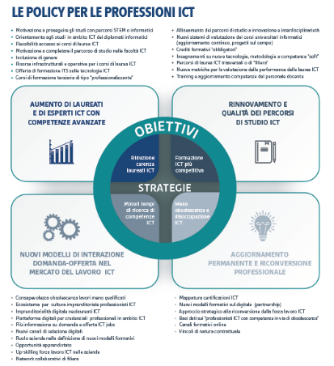

.. _priorità-e-linee-di-intervento-2:

Priorità e linee di intervento
==============================

Si identificano pertanto alcuni interventi prioritari generali che
emergono anche dall’analisi degli altri assi, che sono strutturali e
strategici:

-  identificare interventi di sostegno e promozione per aumentare il
   numero di laureati e di esperti informatici con competenze ICT e
   rinnovare costantemente i percorsi di studio ICT con maggiore
   attenzione alla business innovation;

-  rafforzare l’aggiornamento permanente e la riqualificazione
   professionale con particolare attenzione allo sviluppo tecnologico;

-  avvicinare il mondo della ricerca al mondo imprenditoriale con
   particolare attenzione alle nuove tecnologie emergenti (*IoT*,
   *Blockchain*, Intelligenza Artificiale);

-  favorire la diffusione di nuove figure professionali di livello
   executive altamente innovative;

-  creare nuovi modelli di interazione domanda-offerta nel mercato del
   lavoro ICT, con individuazione di nuovi elementi di osservazione da
   collegare a quelli già oggetto di analisi;

-  ridurre i tempi di ricerca dei professionisti ICT e rendere più
   competitiva la formazione ICT degli attuali laureati ampliandone lo
   spettro conoscitivo.

Nell’ambito degli interventi generali si possono declinare alcune azioni
di rapida attuazione:

-  porre in essere un’evoluzione importante e prioritaria nei percorsi
   di formazione per favorire, a tutti i livelli, lo studio e l’impiego
   delle metodologie, degli approcci e delle tecnologie ICT coniugate
   con la specificità dei diversi domini applicativi;

-  rafforzare la cultura dei modelli di business e management basati
   sull’impiego di tecnologie ICT, nonché la capacità di gestione di
   interventi per la trasformazione digitale sia per il sistema
   industriale che per la PA;

-  riqualificare la forza lavoro con programmi dedicati allo sviluppo
   tecnologico;

-  sostenere l’importanza della formazione sul campo anche tenendo conto
   della formazione tecnica svolta in ambito scolastico;

-  incentivare le aziende a offrire percorsi di formazione sul campo;

-  favorire il trasferimento tecnologico e la nascita di startup anche
   attraverso laboratori di eccellenza a servizio delle imprese, delle
   startup e dei *policy maker*;

-  prevedere forme che consentano ai dipendenti aziendali di trascorre
   dei periodi in Università e Centri di Ricerca per favorire lo scambio
   di conoscenze.

Lo schema di seguito riportato riassume un possibile scenario di
interventi.

|image0|

