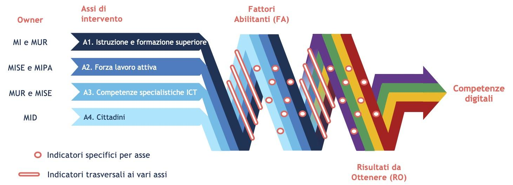

**Strategia Nazionale per le Competenze Digitali**

*16 luglio 2020*

Premessa

*Nel rapporto del Digital Economy and Society Index (DESI) 2020 si
legge: “L'Italia sta avviando iniziative volte a rafforzare le
competenze digitali e affrontare il tema dell'inclusione digitale.
Intensificare e concentrare gli sforzi contribuirebbe a ridurre il
divario digitale tra la popolazione e a garantire che la maggioranza
disponga almeno di competenze digitali di base. Un altro passo
importante in questo ambito sarebbe un approccio globale al
miglioramento delle competenze e alla riqualificazione della forza
lavoro, che comprenda un rafforzamento delle competenze digitali
avanzate”. Nel DESI 2020, nell’area Capitale Umano, l’Italia ha la
peggiore prestazione tra i Paesi europei.*

*La carenza di competenze digitali nei diversi ambiti, per cui l’Italia
risulta tra i Paesi europei più in difficoltà, è una delle principali
limitazioni per lo sviluppo sociale ed economico del Paese e per la sua
ripresa dall’attuale periodo di crisi, assumendo i caratteri della
priorità. Ecco perché è necessario che il tema delle competenze digitali
diventi una priorità strategica per il nostro Paese.*

*Nell’ambito della Strategia Italia 2025 del Ministro per l’Innovazione
tecnologica e la Digitalizzazione del Paese, presentata il 17 dicembre
2019, è stata così inclusa l’iniziativa «Repubblica Digitale», fondata
sulla considerazione che la trasformazione digitale del Paese non può
prescindere dalla contestuale crescita e diffusione della cultura
digitale. L’impatto notevole prodotto dall’emergenza sanitaria rende,
inoltre, ancora più evidente quanto sia fondamentale l’uso del digitale
per la vita sociale ed economica, così come per l’istruzione. In questo
quadro Repubblica Digitale, che vuole rappresentare una risposta
organica e complessiva sul tema delle competenze digitali, si sta
sviluppando in modo significativo:*

-  *il 7 aprile è stata avviata l'elaborazione della presente “Strategia
   Nazionale per le competenze digitali” e del Piano Operativo
   correlato, che sarà consolidato nelle prossime settimane, a partire
   dalle iniziative in essere;*

-  *l’8 aprile l’alleanza multistakeholder costituita nell’ambito di
   Repubblica Digitale*\ `è entrata tra le coalizioni nazionali
   dell’iniziativa europea per le competenze e le professioni
   digitali <https://innovazione.gov.it/l-italia-entra-nella-coalizione-europea-per-le-competenze-digitali/>`__\ *(Digital
   Skills and Jobs Coalition);*

-  *sono state superate le 130 iniziative aderenti alla Coalizione
   Nazionale, promosse da più di 120 organizzazioni, e la loro
   rappresentatività rispetto alle iniziative in atto in Italia è ormai
   molto significativa.*

*In particolare, il presente documento è stato elaborato in un’ottica
corale secondo modalità collaborative mettendo sullo stesso tavolo, come
viene riportato in dettaglio sul sito
https://repubblicadigitale.innovazione.gov.it/it/, ministeri, Regioni,
Province, Comuni, Università, istituti di ricerca, imprese,
professionisti, Rai, le associazioni e le varie articolazioni del
settore pubblico coinvolte, oltre che le organizzazioni aderenti alla
Coalizione Nazionale, fruendo anche di scambi a livello informale con la
Commissione Europea, con una regia affidata al Comitato Tecnico Guida di
Repubblica Digitale, coordinato dal Dipartimento per la trasformazione
digitale della Presidenza del Consiglio dei Ministri su mandato del
Ministro per l’Innovazione tecnologica e la Digitalizzazione.*

*La presente Strategia, insieme al Piano Operativo correlato, a fine
anno sarà sottoposta da parte del Comitato Tecnico Guida a una prima
verifica sulla base dell’analisi dei dati e delle esperienze relative al
2020, e conseguentemente aggiornata, per poi seguire un percorso annuale
di verifica e aggiornamento.*

Sommario

Quadro generale

I dati sullo sviluppo dell'economia e della società digitali disponibili
a livello nazionale e internazionale indicano che l'Italia è
caratterizzata da una significativa carenza di competenze digitali tra
la popolazione. Secondo Eurostat, solo il 42% degli italiani tra i 16 e
i 74 anni possiede competenze digitali almeno a livello base (è il 58%
nell'UE), con un impatto rilevante sull’utilizzo dei servizi digitali.
L’Italia è agli ultimi posti tra i Paesi Europei per l’uso di Internet
(dati Eurostat 2019), con il 17% delle persone di età compresa tra 16 e
74 anni che non ha mai navigato in rete (quasi il doppio della media UE,
pari al 9%). I dati indicano inoltre che solo l'1% dei laureati italiani
possiede un titolo in ambito ICT (peggior posizione nell'UE) e che la
percentuale di specialisti ICT – sebbene sia aumentata nel tempo e abbia
raggiunto il 3,6% dell'occupazione totale – è ancora lontana dalla media
UE (4,2%). Rispetto ai laureati ICT, il gap tra domanda e offerta sta
crescendo, con una carenza di 5.100 unità per i laureati pari al 35%
delle esigenze (dati del Digital Skills Observatory 2019).

La carenza di competenze digitali è per l'Italia uno dei principali
ostacoli allo sviluppo del Paese, e assume le caratteristiche di una
priorità:

-  ha un impatto negativo sia sull’offerta di servizi digitali da parte
   del settore pubblico e del settore privato, sia sull'accesso e la
   fruizione da parte dei cittadini;

-  espone parte rilevante della popolazione al rischio di esclusione
   sociale e dal mercato del lavoro;

-  ostacola l’accesso a forme di partecipazione e consultazione
   pubblica;

-  aumenta il rischio di esposizione dei cittadini alla disinformazione
   su larga scala.\ :sup:` [1]_`

Un livello inadeguato di competenze digitali non riguarda solo la vita
privata dei cittadini, ma ha anche un impatto sulla loro occupabilità e
sull’accesso all’ambiente digitale per l’aggiornamento continuo di
conoscenze e competenze. Un dato su cui porre attenzione riguarda anche
i lavoratori a rischio a causa dei processi di automazione: solo il 20%
di loro beneficia di formazione continua.

Visione e obiettivi

La Strategia `Italia
2025 <https://innovazione.gov.it/assets/docs/MID_Book_2025.pdf>`__
indica un orizzonte chiaro per la sfida “Sviluppo inclusivo e
sostenibile”: lavorare per un’innovazione etica, inclusiva, trasparente
e sostenibile, che aumenti il benessere della società. Questo significa
operare affinché:

-  le capacità digitali delle persone siano rafforzate;

-  lo Stato garantisca uno sviluppo tecnologico etico, responsabile e
   non discriminatorio;

-  i cittadini siano formati per accedere ai lavori del futuro
   attraverso un processo di formazione continua.

*Repubblica Digitale*, l’iniziativa strategica nazionale per le
competenze digitali, è l’anima di questa sfida.

Le competenze digitali costituiscono un asse strategico fondamentale per
la crescita sociale ed economica, ottenibile solo se si realizzano, con
interventi di sistema che sono dettagliati nel seguito, **tre condizioni
di evoluzione sostenibile**:

-  **la popolazione acquisisce sempre più consapevolezza digitale** e
   quindi riesce a sfruttare al meglio i benefici del digitale
   indirizzando un’evoluzione “etica” dell’utilizzo delle tecnologie e
   della loro fruizione sociale;

-  **le pubbliche amministrazioni e le imprese sono indotte a un
   miglioramento dei servizi** forniti, in cui l’utente è visto al
   centro, come persona consapevole, attuando una profonda
   trasformazione, anche dei processi produttivi, che richiede sia
   competenze digitali diffuse (a partire dall’e-leadership dei manager,
   con una reciproca contaminazione di competenze di “business” e
   competenze di trasformazione digitale) che specialistiche;

-  **il sistema educativo si organizza per coprire le esigenze di
   sviluppo delle competenze** (digitali) in modo organico e in una
   logica di continuità e correlazione nel percorso di formazione tra le
   diverse fasi della vita personale e di quella lavorativa.

Questo significa che la crescita, connessa allo sviluppo delle
competenze digitali, non può che avvenire all’interno di un **circolo
virtuoso** in cui, allo stesso tempo, tutti gli stakeholder e, in primo
luogo, agendo come traino complessivo, **tutte le istituzioni e le
amministrazioni pubbliche** **alzano il livello di qualità delle
esigenze** nei confronti degli altri attori e si assumono l’impegno del
cambiamento e del “salto” richiesto dalla trasformazione digitale.
L’attivazione compiuta di un circolo virtuoso sullo sviluppo delle
competenze digitali crea le condizioni per la realizzazione
dell’\ **Agenda 2030**, non solo per quanto riguarda la realizzazione di
un’istruzione di qualità alla portata di tutta la popolazione, ma anche
per l’attuazione di politiche volte a ridurre le disuguaglianze e
assicurare città sostenibili e lavori dignitosi.

*Repubblica Digitale* e la presente *Strategia Nazionale per le
Competenze Digitali*, con il correlato Piano Operativo, vogliono essere
la risposta di sistema per raggiungere questi obiettivi.

La costituzione della Coalizione Nazionale per le competenze e le
professioni digitali, che aderisce alla `Digital Skills and Jobs
Coalition <https://ec.europa.eu/digital-single-market/en/digital-skills-jobs-coalition>`__
della Commissione Europea, ha rappresentato un passo importante in
questa direzione.

Sono principi di base della Strategia:

-  **Educazione al Digitale**: cultura informatica e competenze digitali
   sono requisiti essenziali della cittadinanza; pubblico e privato
   devono investire risorse nel loro sviluppo in quanto fattori
   determinanti per la crescita, la competitività, la creazione di
   valore pubblico e il benessere del Paese, combattendo ogni forma di
   analfabetismo digitale anche attraverso la scuola, l’università e i
   mezzi di comunicazione di massa.

-  **Cittadinanza Digitale**: la tecnologia digitale può favorire lo
   sviluppo di una nuova forma di cittadinanza basata su informazione di
   qualità, partecipazione alle deliberazioni, interazione civica e su
   un rapporto più efficace tra cittadini e Pubblica Amministrazione; il
   digitale progettato ponendo attenzione ai diritti dei cittadini può
   diventare mezzo e linguaggio comune nel dialogo tra cittadini,
   amministrazioni pubbliche e imprese e contribuire al superamento
   delle diseguaglianze.

-  **Digitale etico, umano e non discriminatorio**: il digitale può
   diventare uno spazio di eguaglianza e di sviluppo delle comunità e
   degli individui; pubblico e privato contribuiscono all’eliminazione
   di ogni ostacolo di ordine sociale, economico, geografico,
   tecnologico e culturale che può impedire di fatto l’uguaglianza tra i
   cittadini nell’utilizzo dei servizi pubblici e privati digitali e
   nell’accesso alle opportunità offerte dal digitale.

Gli obiettivi della Strategia, per uno sviluppo sociale ed economico
realizzato attraverso la trasformazione digitale del Paese, sono
pertanto:

-  combattere il divario digitale di carattere culturale presente nella
   popolazione italiana, sostenendo la massima inclusione digitale;

-  sostenere lo sviluppo delle competenze digitali in tutto il ciclo
   dell’istruzione e della formazione superiore;

-  promuovere lo sviluppo delle competenze chiave per il futuro e
   aumentare la percentuale di specialisti ICT, soprattutto nelle
   tecnologie emergenti;

-  garantire a tutta la popolazione attiva le competenze digitali chiave
   per le nuove esigenze e modalità del lavoro.

La Strategia è affiancata da un Piano Operativo con una *roadmap* e
azioni specifiche per:

-  migliorare, supportare e promuovere un approccio sinergico per tutte
   le iniziative relative alle competenze digitali;

-  comunicare l'importanza delle competenze digitali e della cultura
   digitale a tutti i settori della società;

-  promuovere e attuare iniziative nazionali per riqualificare ed
   equipaggiare al meglio sulle competenze digitali gli studenti, la
   forza lavoro, i cittadini tutti.

Sia la Strategia che il Piano Operativo sono aggiornati periodicamente
sulla base di una valutazione del contesto e dell’efficacia delle azioni
intraprese.

Assi di intervento

Sulla base degli obiettivi strategici, e in un quadro organico di
azione, sono stati individuati quattro assi di intervento, in linea con
i quattro pilastri della Coalizione Europea per le competenze e le
professioni digitali:

1. **Istruzione e Formazione Superiore** - per lo sviluppo delle
   competenze digitali all’interno dei cicli d’istruzione formale per i
   giovani, con il coordinamento del Ministero dell’Istruzione (MI) e
   del Ministero dell’Università e della Ricerca (MUR).

2. **Forza lavoro attiva**- per garantire competenze digitali adeguate
   sia nel settore privato che nel settore pubblico, incluse le
   competenze per l’e-leadership, con il coordinamento di Ministero
   dello Sviluppo Economico (MISE) e Ministro per la Pubblica
   Amministrazione (MIPA).

3. **Competenze specialistiche ICT** - per potenziare la capacità del
   Paese di sviluppare competenze per nuovi mercati e nuovi lavori, in
   gran parte legati alle tecnologie emergenti e al possesso delle
   competenze chiave per i lavori del futuro, con il coordinamento di
   Ministero dell’Università e Ricerca (MUR) e Ministero dello Sviluppo
   Economico (MISE).

4. **Cittadini** - per sviluppare le competenze digitali necessarie a
   esercitare i diritti di cittadinanza e la partecipazione consapevole
   alla vita democratica, con il coordinamento del Ministro per
   l’Innovazione tecnologica e la Digitalizzazione (MID).

Per ciascun asse di intervento sono così identificati gli *owner* che
hanno in carico l’elaborazione di questa Strategia, il monitoraggio
degli indicatori, il coordinamento del Piano Operativo e il
raggiungimento degli obiettivi.

Gli interventi promossi all’interno di ciascun asse devono essere di
sistema, trasversali, organici, ad ampio impatto, agili e di rapida
concretizzazione.

Gli assi, di conseguenza, come evidenziato dalla visione e dagli
obiettivi di questa Strategia, condividono delle linee strategiche
comuni, che sono relative allo sviluppo di un modello di formazione
innovativa, a un'organizzazione del lavoro che privilegi il lavoro
agile, a un rapporto con la Pubblica Amministrazione che favorisca
l’attuazione piena dei principi dell’open government e della centralità
del cittadino, nello spirito del Codice dell’Amministrazione Digitale e
del diritto all’accesso ai servizi digitali, anche attraverso l’utilizzo
di open data e licenze aperte.

Inoltre,

-  lì dove sono presenti dei **framework consolidati** (DigComp per le
   competenze digitali di base, DigCompEdu per le competenze dei
   docenti, e-CF per le competenze specialistiche ICT, etc.) bisogna
   prevedere il massimo utilizzo di quanto già realizzato, tenendo conto
   dei limiti di un approccio esclusivamente basato sull’autovalutazione
   e orientando verso l’uso di sistemi di valutazione e qualificazione;

-  **per ciascun asse** di intervento sono individuati **indicatori**,
   **obiettivi misurabili di risultato e di impatto**, a cui sono
   correlate le linee di intervento e le azioni.

Nel promuovere e monitorare le azioni, si pone quindi attenzione non
solo agli aspetti *estensivi* (la copertura degli interventi) ma anche
agli aspetti *intensivi* (la profondità e la qualità degli stessi),
enfatizzando l’impatto che ogni azione ha sulla platea di riferimento.

Risultati attesi

La Strategia si propone di chiudere il *gap* con gli altri Paesi
europei, globalmente e rispetto ai singoli assi di intervento, e di
abbattere i digital divide che caratterizzano il contesto italiano. Al
fine di monitorare i progressi e di valutare l’efficacia della
Strategia, viene predisposto nel Piano Operativo un cruscotto di
indicatori di performance, a partire dagli indicatori inseriti nel
*Digital Economy and Society Index*\ (DESI) della Commissione Europea e
dai *Digital Maturity Indexes*\ (DMI) elaborati dall’Osservatorio Agenda
Digitale del Politecnico di Milano. In particolare da questi ultimi
deriva la distinzione tra:

-  *fattori abilitanti*: ovvero gli elementi che permettono la
   partecipazione dei cittadini e dei lavoratori all’economia e alla
   società digitale;

-  *risultati da ottenere*: ovvero gli elementi che misurano l’effettiva
   partecipazione dei cittadini e dei lavoratori all’economia e alla
   società digitale.

In questo modo è possibile tarare adeguatamente le varie azioni previste
dal Piano Operativo, soprattutto quelle che saranno definite nelle
prossime versioni dello stesso, monitorando se e dopo quanto tempo gli
investimenti abilitanti si traducono in risultati concreti. Come
mostrato in Figura 1 sono definiti degli indicatori per ogni asse di
intervento della strategia e degli indicatori trasversali ai vari assi.

|image0|

*Figura 1. Interconnessioni tra gli assi della strategia*

Per tutti gli indicatori vengono definiti nel Piano Operativo dei
risultati obiettivo tali da consentire, progressivamente entro il 2025,
di ridurre il divario con gli altri Paesi UE e di raggiungere, entro
l’annualità stabilita, una tra le prime tre posizioni rispetto ai Paesi
UE più simili a noi per caratteristiche socio-economiche e demografiche
(Germania, Francia, Spagna e Polonia) e al Regno Unito.

1. Competenze digitali nel ciclo dell’istruzione e della formazione
superiore

La situazione attuale

*Istruzione*

I più recenti dati relativi allo sviluppo delle competenze e delle
tecnologie digitali nel sistema educativo, pur denotando il permanere di
alcuni profili di criticità, confermano il significativo impegno profuso
nell’attuazione di misure dirette a promuovere lo sviluppo delle
competenze digitali degli studenti italiani.

Dalle rilevazioni condotte nell’ambito dell’Indagine della Commissione
europea: “2nd Survey of Schools: ICT in education” (2019) emerge che la
percentuale di scuole italiane che usufruiscono di attrezzature digitali
in linea con lo stato dell’arte della tecnologia è superiore alla media
europea per le scuole primarie e secondarie di secondo grado, mentre
rimane lievemente inferiore per le scuole secondarie di primo grado.
Dall'indagine OCSE 2018 sull'insegnamento e l'apprendimento (Teaching
and Learning International Survey - TALIS) emerge tuttavia che in media
- in Italia - il 31% dei dirigenti scolastici ritiene che la qualità
dell’istruzione nella propria scuola sia frenata da una inadeguatezza
della tecnologia digitale per la didattica (vs. una media del 25% dei
Paesi OCSE TALIS).

Per quanto riguarda il livello di connettività, nella fascia 30-100
mbps, i dati registrati per le scuole italiane risultano in linea con la
media dei Paesi europei, mentre permangono profili di criticità rispetto
all’accesso a servizi di connettività a banda larga, laddove i dati
italiani rilevati in relazione a tutti gli ordini di scuola si attestano
al di sotto della media europea.

Nell’utilizzo di strumenti digitali nel corso delle lezioni, si registra
un sostanziale allineamento del dato italiano rispetto alla media degli
altri Paesi europei. Quanto all’impiego di device personali si segnala,
tuttavia, quale profilo di criticità, l’inferiorità alla media europea
del dato italiano sull’utilizzo degli smartphone a scopo didattico.

Anche il grado di sicurezza degli studenti nell’uso delle tecnologie
digitali risulta in linea con la media europea. Dalle rilevazioni
dell’Osservatorio permanente scuola digitale del Ministero
dell’Istruzione, risulta che le scuole che realizzano progetti didattici
per lo sviluppo delle competenze digitali sono il 78,34%, mentre
l’86,44% delle scuole realizza progetti sulla cittadinanza
digitale\ :sup:` [2]_`.

Come emerge dal rapporto della rete Eurydice su "Digital Education at
School in Europe" del settembre 2019, permane, tuttavia, quale profilo
di criticità – peraltro comune ai principali Paesi europei – il dato
relativo all’assenza di un sistema strutturato di valutazione e
certificazione delle competenze digitali da parte degli studenti.

Per quanto concerne la formazione dei docenti, si registra un maggior
numero di docenti italiani che si formano nell’uso delle tecnologie
digitali e delle relative applicazioni rispetto alla media europea.
Permane, tuttavia, un diffuso fabbisogno di formazione sull’uso delle
ICT, con una media di docenti italiani che si sentono sicuri nelle loro
capacità di utilizzo degli strumenti digitali lievemente inferiore alla
media europea\ :sup:` [3]_`. Il dato è confermato dall’Indagine OCSE
TALIS 2018, dalla quale emerge come la formazione sull’uso delle ICT sia
tra i temi dello sviluppo professionale di cui gli insegnanti segnalano
un forte bisogno (il 17% in Italia vs. 18% media dei Paesi OCSE).

Dall’indagine OCSE “Measuring innovation in education 2019” emerge,
inoltre, come in Italia si registri un livello moderato di innovazione
nelle pratiche di apprendimento, lievemente al di sotto della media dei
paesi OCSE. Il tasso di crescita italiano risulta superiore alla media
OCSE per quanto riguarda gli indici relativi alle risorse educative e
agli strumenti informatici messi a disposizione dalle scuole, all’uso
delle TIC nella didattica e al ricorso a pratiche di apprendimento
attivo nelle discipline scientifiche. A frenare l’indice complessivo di
innovazione educativa sono invece i processi di formazione per gli
insegnanti, che rimangono più legati a metodologie tradizionali.

*Università e Alta Formazione*

La carenza di competenze digitali, sia di base sia avanzate, si traduce
in una minore disponibilità e utilizzo di servizi on line. Ne deriva la
necessità di potenziare la capacità del mondo della scuola e del sistema
universitario di accrescere le competenze digitali quale elemento
imprescindibile per la trasformazione digitale della Pubblica
Amministrazione e del sistema produttivo.

-  *L’offerta formativa* universitaria nel settore ICT nel 2018/2019
   contava 320 Corsi di Studio (CdS) per un totale di 10.260
   insegnamenti. Sono quasi del tutto assenti percorsi formativi che
   integrino competenze ICT e competenze di dominio; minimo il ricorso
   alle “lauree professionalizzanti”. Nonostante il numero di
   immatricolati registri un trend di costante crescita, il gap fra
   laureati e richieste dal mercato è molto elevato: dalle stime
   dell’Osservatorio Competenze Digitali 2019, nel settore ICT c’è una
   carenza di circa 15.000 laureati. Va, inoltre, evidenziata la
   necessità di favorire e sostenere la partecipazione delle donne che
   decidono di intraprendere la loro formazione nei settori tecnici e
   dell’ICT in particolare per garantire uno sviluppo armonico e
   partecipativo del nostro sistema sociale.

-  Per quanto concerne il contesto informatico al di fuori dei CdS
   specialistici, si registra che la cultura informatica è assente dagli
   insegnamenti nel 60% dei CdS economico-aziendali e nel 70% dei CdS
   d’area umanistica. Indipendentemente dalle etichettature
   accademiche/disciplinari dei corsi, valutando i contenuti, l’offerta
   di area informatica copre il 7% dei percorsi di matematica, fisica,
   statistica, il 3,4% di quelli economico-aziendali, il 10% di quelli
   delle comunicazioni digitali e il 2% di tutti gli altri corsi
   scientifici, umanistici e giuridici.

Iniziative in corso

*Istruzione*

Uno dei principali strumenti di programmazione per il potenziamento
delle competenze digitali degli studenti è il Piano Nazionale per la
Scuola Digitale (PNSD). Il Piano si compone di 35 azioni suddivise in
tre ambiti di intervento:

1. strumenti: azioni finalizzate a dotare le scuole di nuovi ambienti di
   apprendimento basati sulle nuove tecnologie digitali, dove è
   possibile sperimentare e attuare metodologie didattiche innovative;

2. competenze e contenuti: azioni finalizzate a promuovere e a
   potenziare le competenze digitali degli studenti e a favorire lo
   sviluppo di contenuti di qualità per la didattica digitale;

3. formazione: azioni destinate a supportare l’innovazione didattica e
   digitale attraverso percorsi di formazione per il personale
   scolastico.

Oltre alle azioni del PNSD, un ulteriore apporto alle iniziative dirette
al potenziamento delle competenze digitali degli studenti deriva dalle
risorse disponibili a valere sui Fondi Strutturali Europei PON “Per la
Scuola – Competenze e ambienti per l’apprendimento” 2014 – 2020.

Il Programma - che offre a tutte le scuole la possibilità di accedere
alle risorse finanziarie europee - si articola in 4 assi, ciascuno con i
propri obiettivi specifici:

-  “Asse 1 - Istruzione”: mira a investire nelle competenze,
   nell’istruzione e nell’apprendimento permanente.

-  “Asse 2 - Infrastrutture per l’istruzione”: punta a potenziare le
   infrastrutture scolastiche e le dotazioni tecnologiche.

-  “Asse 3 - Capacità istituzionale e amministrativa”: riguarda il
   rafforzamento della capacità istituzionale e la promozione di
   un’Amministrazione Pubblica efficiente.

-  “Asse 4 - Assistenza tecnica": è finalizzato a migliorare
   l’attuazione del Programma attraverso il rafforzamento della capacità
   di gestione dei Fondi.

Ulteriori esperienze per la promozione di metodologie didattiche
innovative e il potenziamento delle competenze - anche digitali - di
insegnanti e studenti derivano dall’adesione ai progetti Erasmus Plus,
il programma dell’Unione europea in virtù del quale tutte le scuole
hanno la possibilità di beneficiare di fondi destinati a progetti di
mobilità internazionale per lo sviluppo professionale del personale
docente e a partenariati transnazionali, che offrono agli studenti
l’occasione di visitare scuole partner di altri Paesi, attraverso
soggiorni di gruppo di breve durata o periodi di scambio più lunghi per
singoli studenti della scuola secondaria.

Tra le iniziative di maggior impatto nell’ambito del programma, si
segnala il progetto eTwinning, la più grande community europea di
insegnanti attivi nei gemellaggi elettronici tra scuole, che, tramite
una piattaforma informatica, coinvolge in Italia oltre 45.000 docenti,
favorendone la collaborazione grazie alle potenzialità delle nuove
tecnologie, allo scopo di promuovere una nuova didattica basata sullo
scambio e la collaborazione.

Infine, l’approccio strategico del Ministero dell’Istruzione, anche con
la visione di valorizzare l’autonomia scolastica, è da molto tempo teso
- attraverso l’attivazione di partnership che costituiscono esempi
virtuosi di collaborazione tra Scuola, Università, associazioni non
profit e realtà imprenditoriali del settore - alla promozione di
iniziative dirette al potenziamento delle competenze digitali degli
studenti, supportando lo sviluppo sia di soft skill e di competenze
digitali di base che di competenze specifiche afferenti al settore ICT.

*Università e Alta Formazione*

Tra le iniziative istituzionali che cercano di creare percorsi formativi
che integrino competenze ICT e competenze di dominio rileviamo che:

-  c’è un minimo ricorso alle “lauree professionalizzanti”, attualmente
   non ritenute adatte e non ben correlate con le altre lauree;

-  per il dominio economico aziendale, in alcuni dipartimenti
   informatici sono nati CdS nei quali l’informatica e la cultura
   economica sono coniugati nel medesimo percorso;

-  sono stati recentemente annunciati o sono in avvio corsi di laurea
   triennali del settore economico aziendale con forte connotazione ICT
   e AI.

Accanto all’offerta formativa curricolare, negli ultimi anni, nelle
Università, si sono sviluppate numerose iniziative di formazione, in
stretta collaborazione con le imprese. Queste iniziative, spesso
raggruppate sotto l’etichetta di **Academy**, tendono a configurarsi
come delle learning organizations in cui studenti e docenti sono
incoraggiati a creare, per la durata del percorso formativo, delle vere
e proprie comunità di pratica capaci di valorizzare competenze pregresse
ed attitudini di ciascuno, trasformandole in risorse per la crescita
culturale di tutti.

Una prima indagine condotta nell’ambito dei lavori del tavolo Repubblica
Digitale ha consentito di censire oltre 25 Academy, distribuite in 14
Regioni, con il coinvolgimento di realtà industriali e del mondo dei
servizi di rilevanza nazionale e multinazionale, sia nel settore ICT sia
in settori non-ICT. A queste si aggiungono un numero significativo di
iniziative tese a diffondere la cultura digitale presso particolari
segmenti di popolazione (a titolo puramente esemplificativo si
richiamano le iniziative che mirano ad avvicinare le ragazze agli studi
di Informatica e Ingegneria dell'Informazione) e gli osservatori
finalizzati a classificare best practices, progetti ed esperienze di
innovazione digitale.

Priorità e linee di intervento

*Istruzione*

Al fine di favorire la diffusione della cultura digitale nell’ambito dei
percorsi di formazione, si ritiene di poter individuare le seguenti
macro-aree di intervento, sulla cui base procedere alla costruzione di
un processo di innovazione.

**Digitalizzazione infrastrutturale del sistema scolastico**

È indispensabile perseverare nella promozione di iniziative per la
modernizzazione in chiave digitale delle scuole.

Ci si propone, quindi, di continuare ad investire per la dotazione di
strumenti per la didattica digitale e per il potenziamento della
connettività delle scuole con l’utilizzo della banda larga e di quella
ultra-larga, anche con interventi mirati alla diminuzione dei relativi
costi, vere e proprie barriere alla infrastrutturazione digitale e,
quindi, ad un’efficace formazione degli studenti.

**Sviluppo di competenze e cultura digitale degli studenti**

È fondamentale investire sull’implementazione delle competenze digitali
degli studenti, sin dalla scuola primaria, supportando lo sviluppo sia
di soft skill e competenze digitali di base (compreso il coding) che, in
ragione dell’ordine, del grado e dell’indirizzo di studi, di competenze
specifiche afferenti al settore ICT, attraverso interventi diretti a:

-  promuovere network collaborativi di filiera come modelli di
   accelerazione per il rafforzamento di competenze digitali e
   iniziative dirette ad offrire agli studenti l’opportunità di vivere
   esperienze di imprenditorialità attiva;

-  rendere la didattica per lo sviluppo delle competenze digitali
   strutturale nel curricolo, ad esempio introducendo lo studio del
   pensiero computazionale e del coding nel curricolo del primo ciclo;

-  sottoporre le competenze digitali degli studenti a costante
   valutazione e certificazione all’interno degli ordinamenti
   scolastici, anche applicando il quadro di riferimento per le
   competenze digitali dei cittadini, DigComp, elaborato dallo European
   Commission’s Joint Research Centre;

-  intensificare le iniziative volte all’apprendimento di nuove
   metodologie didattiche che, superando la tradizionale lezione
   frontale, siano utili anche a tradurre le potenzialità della
   tecnologia in paradigmi didattici innovativi;

-  promuovere, anche alla luce dei fabbisogni emersi nel corso dell’anno
   scolastico 2019/2020 nel fronteggiare lo stato di emergenza sanitaria
   nazionale, l’impiego di strumenti e di piattaforme digitali per lo
   svolgimento dell’attività didattica, in presenza e a distanza.

Costituiscono altresì pre-condizioni all’implementazione dell’azione di
regia del Ministero e ad assicurare la coerenza complessiva della
strategia, due driver, che non solo si innestano nella relazione
biunivoca tra studenti e docenti, ma che richiedono un approccio di
governance multilivello che integri tutti gli attori a vario titolo
coinvolti nel processo educativo:

-  l’acquisizione da parte dei docenti di conoscenze circa i principali
   criteri di sicurezza informatica, come perimetro allo sviluppo delle
   competenze digitali;

-  la promozione di progetti di media education, diretti a favorire
   l’uso consapevole dei nuovi strumenti di informazione e
   comunicazione, al fine di contenere i rischi tipicamente associati
   all’uso delle tecnologie e di cogliere quindi le opportunità delle
   alleanze per una comunicazione positiva ed etica.

**Formazione digitale del personale docente**

Occorre intervenire sulle competenze digitali del personale docente,
ponendo particolare attenzione alla differenziazione dell’offerta
formativa, anche promuovendo esperienze di alta formazione per docenti
con forte propensione alla cultura digitale.

La formazione dei docenti può diventare strategica con l’adozione di
percorsi formativi stabili, disegnati al fine di acquisire le competenze
digitali, rispetto alle quali un riferimento organico può essere
individuato nel framework europeo DigCompEdu\ :sup:` [4]_` per la
misurazione delle competenze digitali di docenti ed educatori.

**Rafforzamento della formazione in tema ICT nell’ambito dei percorsi
per le competenze trasversali e l’orientamento**

Nell’ambito dei Percorsi per le competenze trasversali e per
l’orientamento (già percorsi di “alternanza scuola - lavoro”), si può
ulteriormente valorizzare, anche attraverso l’attivazione di partnership
con settori industriali - grandi, medi e piccoli - nonché associazioni
ed enti pubblici, l’adesione delle scuole a progetti innovativi, che
prevedano la fertilizzazione dell’uso delle tecnologie avanzate per lo
sviluppo delle competenze digitali e trasversali degli studenti.

**Rafforzamento dei percorsi di orientamento alla formazione
universitaria per gli studenti in uscita dalla scuola secondaria di
secondo grado**

Costituisce, infine, una priorità la promozione di percorsi di
orientamento per gli studenti in uscita dalla scuola secondaria di
secondo grado verso l’Università e il mondo del lavoro, sostenendo
iniziative che costituiscano esempi virtuosi di collaborazione, nel
quadro di un generale rafforzamento dei rapporti tra Scuola, Università
e realtà imprenditoriali operative nel settore ICT.

*Università e Alta Formazione*

**Raccordo tra la Scuola e l’Università**

L’orientamento deve fornire ai giovani un maggiore supporto sia per
quanto concerne la capacità di analizzare e conoscere meglio i Corsi di
Studio ad indirizzo scientifico e tecnologico sia per quanto riguarda la
consapevolezza della centralità del “pensare digitale”. Ciò richiede di
investire sul potenziamento della cultura digitale degli insegnanti,
indipendentemente dalle specifiche discipline, per fare del “pensare
digitale” una componente strutturale dei processi educativi.

Si deve attivare una maggior collaborazione tra il mondo della scuola e
quello dell’Università sulla base di iniziative congiunte che
favoriscano in modo più immediato e strutturato la crescita e lo scambio
di conoscenze ed esperienze.

**Adeguamento delle modalità di erogazione della didattica**

Si deve attivare una collaborazione all’interno del sistema della
formazione nel suo complesso, per l’adeguamento dei programmi e delle
metodologie di erogazione della didattica e per promuovere e sostenere
la continuità dei percorsi formativi.

**Definizione di un portafoglio digitale**

Si intende:

1. definire un portafoglio digitale, con traiettorie orizzontali e
   verticali (professionalizzanti) che preveda diversi livelli di
   maturità;

2. definire e attuare percorsi formativi (con riferimento al portafoglio
   digitale) fruibili in modalità online, *blended learning* e percorsi
   flessibili;

3. integrare il portafoglio digitale nei percorsi formativi esistenti.

**Raccordo tra Università e mondo della produzione**

Si intende:

-  potenziare i corsi di studio a carattere professionalizzante, in
   sinergia con industrie e mondo della scuola;

-  consolidare i percorsi di formazione fortemente orientati alla
   ricerca industriale e all’innovazione, per formare profili altamente
   qualificati capaci di promuovere e accompagnare i nuovi paradigmi
   produttivi;

-  promuovere forme di partnership Università-industria finalizzate alla
   realizzazione di percorsi formativi innovativi contestualizzati a
   specifici scenari di business.

**Potenziamento capitale umano e infrastrutture**

Si intende intervenire per:

-  il potenziamento del capitale umano in termini di ricercatori
   impegnati nelle attività didattiche e scientifiche relative al
   settore dell'ICT, tenendo conto dei risultati che emergono
   dall’analisi dei dati delle richieste provenienti dal mondo
   produttivo e della Pubblica Amministrazione. In particolare,
   considerandoi risultati complessivi emersi dai lavori di Repubblica
   Digitale, i dati dell’Osservatorio delle Competenze Digitali nonché
   il Piano Nazionale della Ricerca, che recepisce le linee strategiche
   della prossima programmazione a livello europeo, si evidenziano due
   necessità:

   -  potenziamento e integrazione di competenze specialistiche nei
      settori dell’informatica e dell’ingegneria informatica (scienza
      dei dati e *big data*, intelligenza artificiale, *cloud*,
      *cybersecurity*, tecnologie di sviluppo software, architettura dei
      sistemi di elaborazione), della statistica, della modellistica,
      delle tecnologie e tecniche di gestione per supportare la
      trasformazione digitale e Industria 4.0 (*Internet of things*,
      sistemi embedded di integrazione delle tecnologie
      dell’Informatica, delle Telecomunicazioni e dell’Elettronica),
      della robotica, delle applicazioni di *high performance
      computing*, della connettività, della scienza dei servizi, del
      management dei sistemi tecnologici e delle loro integrazioni nei
      sistemi produttivi e della PA;

   -  maggiore integrazione tra le tematiche e gli obiettivi specifici
      dei Corsi di Studio delle diverse classi di laurea e le competenze
      delle tecnologie e metodologie proprie delle applicazioni
      dell’informatica, tenendo conto anche che tali discipline
      risultano di base in molti corsi di studio;

-  la realizzazione di laboratori e, più in generale, di spazi di lavoro
   in cui realizzare la contaminazione tra ricercatori, studenti e
   professionisti di diversa estrazione culturale e disciplinare,
   favorendo lo sviluppo e l’incubazione di progetti innovativi a
   vocazione imprenditoriale. La realizzazione di questi spazi dovrebbe
   vedere la collaborazione fra Università e sistema produttivo e
   dovrebbe essere pensata per la fruizione in presenza e a distanza;

-  un raccordo costante con il sistema della scuola e con il sistema
   produttivo per migliorare il ciclo complessivo della formazione,
   l’orientamento e la formazione continua, sviluppando, anche
   attraverso partnership Università-industria, nuove forme di didattica
   in presenza con l’integrazione di servizi telematici evoluti;

-  estendere le analisi degli osservatori anche al livello delle
   competenze richieste oltre che alla tipologia, come già avviene,
   nonché alle forme in cui si sviluppano i percorsi di formazione non
   curricolari.

**Interventi sull’attuale offerta formativa**

Si intende intervenire in termini di:

-  revisione e rafforzamento della cultura informatica fondamentale e
   trasversale necessaria alla trasformazione digitale della formazione
   universitaria in tutte le classi;

-  riorganizzazione e rafforzamento delle discipline ICT abilitanti per
   la trasformazione digitale;

-  allineamento dei percorsi formativi specialistici alle esigenze delle
   professioni interessate dalla trasformazione digitale.

Impatto e indicatori

*Istruzione*

Nell’ambito della strategia per il potenziamento delle competenze
digitali degli studenti, si intende costruire un piano operativo di
azioni a breve, medio e lungo termine e, al contempo, definire un set di
indicatori da utilizzare ai fini della misurazione dell’impatto delle
iniziative oggetto di programmazione, anche alla luce dei nuovi processi
legati ai fabbisogni formativi emersi nel corso del presente periodo di
emergenza sanitaria derivante dalla pandemia di Convid-19.

L’impatto atteso, coerentemente con gli obiettivi definiti nell’ambito
della Strategia, concerne:

-  l’innalzamento del livello delle competenze digitali del personale
   docente ed educativo;

-  l’innalzamento del livello di competenze digitali degli studenti in
   uscita dai percorsi del I e del II ciclo di istruzione;

-  l’aumento del numero di studenti in uscita dalla scuola secondaria di
   secondo grado che intraprendono percorsi universitari in ambito ICT;

-  la riduzione del divario di genere tra gli studenti in uscita dalla
   scuola secondaria di secondo grado che intraprendono percorsi di
   studio e/o professionali in ambito STEM;

-  l’aumento del numero di studenti coinvolti in iniziative di sviluppo
   delle competenze digitali, anche nell’ambito dei percorsi per la
   competenze trasversali e l’orientamento;

-  l’aumento del numero di studenti che utilizzano ordinariamente
   internet, dispositivi e contenuti digitali per lo svolgimento di
   attività legate all’apprendimento.

*Università e Alta formazione*

La formazione scolastica e universitaria e l’alta formazione digitale
del Paese sono elementi imprescindibili della trasformazione digitale
della Pubblica Amministrazione e del sistema produttivo.

Il sistema della formazione nel suo complesso deve contribuire in modo
coerente a sostenere i processi di investimento sul capitale umano, che
devono guidare la definizione di nuovi processi organizzativi e
produttivi attraverso lo sviluppo di metodologie e tecnologie
innovative. Si tratta di coniugare insieme il “pensare digitale” con lo
sviluppo delle necessarie competenze per poter realizzare sistemi
tecnologici all’avanguardia.

L’impatto può essere misurato sulla base di:

-  qualificazione dei percorsi di orientamento in entrata e uscita;

-  adeguamento delle modalità di erogazione della didattica attraverso
   l’impiego delle tecnologie ICT con la progettazione di nuovi servizi
   per gli studenti (lavoro cooperativo, disponibilità di materiali on
   line, supporto all’assistenza agli studenti, supporto all’erogazione
   in presenza degli interventi didattici);

-  modifica e adeguamento dei percorsi formativi dell’attuale offerta
   formativa alle esigenze delle professioni interessate dalla
   trasformazione digitale;

-  potenziamento di percorsi di formazione fortemente orientati alla
   ricerca industriale e all’innovazione;

-  potenziamento del capitale umano e delle infrastrutture in termini di
   ricercatori impegnati nelle attività didattiche e scientifiche
   relative al settore dell'ICT e delle sue applicazioni;

-  adeguamento dei modelli di analisi degli osservatori.

Quadro d’insieme

*Istruzione*

+-------------------------+---+--------------+--+
| **SITUAZIONE ATTUALE**  | > | **PRIORITÀ** |  |
+-------------------------+---+--------------+--+
|                         |   |              |  |
+-------------------------+---+--------------+--+
| V                       |   | V            |  |
+-------------------------+---+--------------+--+
| **LINEE DI INTERVENTO** | > | **IMPATTO**  |  |
+-------------------------+---+--------------+--+
|                         |   |              |  |
+-------------------------+---+--------------+--+

*Università e Alta Formazione*

+-------------------------+---+--------------+--+
| **SITUAZIONE ATTUALE**  | > | **PRIORITÀ** |  |
+-------------------------+---+--------------+--+
|                         |   |              |  |
+-------------------------+---+--------------+--+
| V                       |   | V            |  |
+-------------------------+---+--------------+--+
| **LINEE DI INTERVENTO** | > | **IMPATTO**  |  |
+-------------------------+---+--------------+--+
|                         |   |              |  |
+-------------------------+---+--------------+--+

2. Competenze digitali nella forza lavoro attiva

La situazione attuale

*Settore privato e non occupati*

La transizione digitale dell’impresa è una delle grandi sfide di
politica industriale europea insieme a quella della transizione
ambientale. È una sfida che ha al suo cuore la questione del capitale
umano e dell’accompagnamento delle imprese nell’integrazione delle
tecnologie all’interno dei propri processi al fine di creare una
produttività innovativa e realmente sostenibile. Bisogna considerare
nello sviluppo dei sistemi di produzione lo sviluppo e l’integrazione di
tecnologie emergenti, quali:\ *Blockchain*, *IoT*, *AI*, *Quantum
Computing*, Sistemi *Embedded*, *Data Mining*, *Cybersecurity*, Sistemi
di calcolo ad alte prestazioni e sviluppo di sistemi software
certificati. Un significativo risalto va dato anche al rapporto tra lo
sviluppo delle tecnologie digitali e la green economy. Sono tematiche
molto importanti alla luce della realizzazione di nuovi sistemi di
produzione più sostenibili e inclusivi. Alcuni elementi di valutazione:

-  il 30% della nuova forza lavoro necessaria in Italia sarà impiegato,
   nei prossimi anni, in lavori legati all’utilizzo di tecnologie
   digitali o all’economia circolare. Già oggi le imprese che puntano
   sull’innovazione e cercano di allargare il proprio mercato di
   riferimento, facendo leva anche sull’export, richiedono competenze
   digitali nell’analisi dei dati, nella programmazione e nella gestione
   di soluzioni innovative;

-  in uno scenario tecnologico in continua evoluzione, le professioni
   tradizionali sono quindi sottoposte, e sempre più lo saranno in
   futuro, ad una azione costante di upskilling e reskilling. Al
   contempo si affacciano sul mercato, guidato dalla domanda, i nuovi
   attori della rivoluzione digitale in corso quali ad esempio
   l’\ *artificial intelligence specialist*, il *big data analyst*, il
   *cloud computing expert*, il *business intelligence analyst* o il
   *social media marketing manager;*

-  è da sottolineare l’importante contributo delle donne allo sviluppo
   tecnologico del sistema Paese e l’importanza data dall’Italia alla
   dichiarazione “Women in Digital” firmata a livello UE il 9 aprile
   2019 durante il Digital Day 2019\ :sup:` [5]_`;

-  In questo contesto in cambiamento, il Digital Economy & Society Index
   (DESI) posiziona l’Italia, anche nel 2020, ai livelli più bassi per
   quel che riguarda la dimensione “Capitale umano” che include l’uso di
   internet e le competenze digitali di base e avanzate. Una situazione
   certamente non incoraggiante sia per quel che concerne l’efficienza
   della PA, sia per la competitività del sistema economico nel suo
   complesso. La scarsa digitalizzazione ha infatti profondi effetti su
   crescita e produttività;

-  se si considera che attualmente gli occupati ICT rappresentano il 4%
   dei lavoratori, la grande sfida del Paese sarà quella di sostenere i
   nuovi attori, gli specialisti, e le loro competenze strategiche, nel
   loro affermarsi sul mercato e, contemporaneamente, di potenziare le
   competenze digitali per il restante 96% dei lavoratori non ICT,
   rafforzando il tessuto imprenditoriale ad ampio spettro. Tale dato è
   ancora più significativo se si considera che solo una quota parte
   degli occupati nel settore ICT svolge attività di sviluppo tecnico e
   ancor minori sono gli occupati in settori che sviluppano o utilizzano
   tecnologie di frontiera;

-  appare quindi evidente la necessità di supportare il tessuto
   imprenditoriale con azioni volte a sostenere da un lato la
   trasformazione tecnologica dei relativi modelli di business e
   dall’altro la formazione del personale coinvolto, a tutti i livelli,
   unitamente ad una azione informativa che guidi passo passo gli attori
   interessati al fine di consentirgli di individuare il percorso di
   digitalizzazione più vicino alle reali esigenze, utilizzando al
   meglio i migliori e più efficaci strumenti attualmente in campo.

*Settore pubblico*

L’affermazione di una cultura digitale e dell’innovazione condivisa a
tutti i livelli dell’amministrazione rappresenta un fattore chiave per
accelerare il processo di trasformazione della Pubblica Amministrazione
italiana in senso innovativo e migliorare i servizi offerti all’utenza.
Ad oggi la carenza di competenze digitali si manifesta a tutti i livelli
della Pubblica Amministrazione, sia decisionali che operativi:

-  la maggioranza delle pubbliche amministrazioni non ha ancora
   provveduto alla nomina del Responsabile alla transizione alla
   modalità operativa digitale, previsto dall’art. 17 del CAD (d.lg.
   82/2005). Inoltre, molte delle risorse chiamate a ricoprire tale
   ruolo non dispongono di adeguate competenzetecnologiche, di
   informatica giuridica e manageriali previste dalla norma. Tale
   ritardo, evidenziato nella Relazione finale della Commissione
   parlamentare d’inchiesta sulla digitalizzazione della PA approvata
   nel 2017, si dimostra ancora più significativo se si considera che,
   sebbene l’ultima formulazione dell’art. 17 del CAD risalga al 2016,
   la richiesta di individuare un unico centro di competenza sul
   digitale è prevista dal 1993 per le amministrazioni centrali;

-  l’eccessiva focalizzazione - soprattutto nei percorsi di selezione -
   sulle competenze di tipo giuridico-amministrativo ha contribuito nel
   tempo all’affermazione di una classe dirigente spesso sprovvista
   delle competenze necessarie a riconoscere le opportunità di
   innovazione e a coordinare i processi di cambiamento abilitati dalle
   tecnologie digitali che coinvolgono direttamente le funzioni e le
   procedure operative presidiate (una ricerca avviata nel 2018 dalla
   Scuola Nazionale dell’Amministrazione segnala la prevalenza tra i
   dirigenti pubblici di capacità informatiche operative piuttosto che
   di competenze riferibili ad una gestione dell’ICT più strategica e
   manageriale\ :sup:` [6]_`);

-  il capitale umano della PA italiana nel suo complesso risulta male
   attrezzato, anziano (il 45% dei dipendenti pubblici italiani è sopra
   i 54 anni contro il 22% della media OCSE\ :sup:` [7]_`) e soprattutto
   poco qualificato (solo il 38% del personale pubblico ha conseguito un
   titolo universitario e il 3% un titolo post-laurea\ :sup:` [8]_`). A
   questa scarsa qualificazione non si è rimediato negli ultimi anni con
   appropriati investimenti in formazione, in particolar modo in ambito
   digitale (nel 2017, la formazione in materia di digitalizzazione ha
   registrato poco più di 126.000 partecipanti pari a circa il 5% del
   totale\ :sup:` [9]_`).

Iniziative in corso

*Settore privato e non occupati*

La Pubblica Amministrazione, nell’ambito di una complessiva strategia di
sistema volta a sostenere il tessuto imprenditoriale del Paese nel
cogliere le opportunità fornite dall’innovazione tecnologica, ha messo
in campo un set di strumenti volti a:

-  potenziare le competenze digitali;

-  indirizzare le imprese alla trasformazione tecnologica;

-  diffondere l’innovazione a tutti i livelli;

-  raccordare il mondo della ricerca con il mondo imprenditoriale;

-  sostenere la domanda di soluzioni tecnologiche innovative.

Allo stesso modo, nel settore privato, sempre più attenzione è stata
posta nei confronti dei temi legati alla formazione e all’innovazione di
processo o di prodotto. Inoltre:

-  In tema di accompagnamento alle imprese nella trasformazione digitale
   dei propri processi di business, un ruolo attivo viene svolto,
   attraverso una stretta sinergia pubblico-privato, dal Ministero dello
   Sviluppo Economico (MiSE). In parallelo ai Competence Center, che
   svolgono funzioni di supporto al trasferimento tecnologico, di
   sperimentazione delle nuove tecnologie abilitanti e di alta
   formazione sulle tecnologie, insieme alle Associazioni di categoria e
   al sistema Camerale, è stato creato un percorso di sviluppo che vede
   in campo l’azione coesa dei PID, Punti Impresa Digitale, dei DIH,
   *Digital Innovation Hub*, fino ad arrivare agli EDIH, gli *European
   Digital Innovation Hub*. Un complesso di nodi strutturali che,
   attraverso parole d’ordine quali sperimentazione, trasferimento
   tecnologico, formazione, informazione e digitalizzazione, costituisce
   l’ossatura con la quale vengono offerte e testate le policy 4.0 messe
   in campo dall’Amministrazione.

-  Il processo informativo e di accompagnamento appena descritto non può
   prescindere dalla presenza di una forte componente di formazione, sia
   interna che esterna. In questo contesto trova spazio l’iniziativa
   degli ITS\ :sup:` [10]_`, vere e proprie scuole di alta tecnologia
   strettamente legate al sistema produttivo che preparano i quadri
   intermedi specializzati che nelle aziende aiutano a governare e
   sfruttare il potenziale delle soluzioni di Impresa 4.0. Sull’onda
   della trasformazione digitale, l’offerta formativa negli ultimi anni,
   a riprova di una domanda in costante crescita, si è ampliata, sia per
   quanto attiene alla Pubblica Amministrazione che per quanto attiene
   al settore privato, con strumenti e azioni volte ad aumentare il
   grado di specializzazione nel settore ICT\ :sup:` [11]_`, a
   potenziare le competenze digitali per il lavoro\ :sup:` [12]_` a
   rafforzare la capacità di innovazione e la cultura digitale della
   Pubblica Amministrazione\ :sup:` [13]_`, e anche a certificare il
   grado di competenza conseguito\ :sup:` [14]_`.

-  In un contesto di necessario e continuo sviluppo tecnologico,
   particolare importanza è rivestita da tutte quelle azioni che in
   qualche modo facilitano il tessuto imprenditoriale nel porre in
   essere determinate azioni. È questo il caso degli strumenti di
   incentivazione (credito di imposta, *voucher* e altre misure
   agevolative) per l’introduzione di tecnologie abilitanti la
   trasformazione digitale\ :sup:` [15]_`, per lo sviluppo delle
   competenze digitali dei lavoratori\ :sup:` [16]_`, per la
   realizzazione della *digital transformation* attraverso progetti
   diretti all’implementazione delle tecnologie abilitanti di cui al
   piano industria 4.0 e delle tecnologie digitali di filiera, e infine
   per l’attivazione di servizi a banda ultralarga.

-  Ogni azione di sviluppo e trasformazione necessita di un luogo che
   funga da aggregatore e attrattore e quindi da riferimento per gli
   stakeholder del settore sul territorio. Un punto di incontro tra
   mondo della ricerca e mondo dell’impresa. È questo il caso della Casa
   delle tecnologie emergenti, di cui si tratterà nel capitolo
   “competenze specialistiche ICT e competenze chiave del futuro”. Un
   vero e proprio centro di trasferimento tecnologico che sarà
   realizzato nei Comuni oggetto di sperimentazione 5G per supportare
   progetti di ricerca e sperimentazione, la creazione di startup e il
   trasferimento tecnologico verso le PMI, sui temi che prevedono
   l’utilizzo di *Blockchain*, *IoT* e Intelligenza
   Artificiale\ :sup:` [17]_`.

-  Il sostegno alla domanda viene promosso nell’ambito della “Strategia
   nazionale di specializzazione intelligente 2014-2020”\ :sup:` [18]_`,
   elaborata da MISE e MUR, approvata dalla Commissione Europea, che
   individua nella domanda pubblica di innovazione (appalti di
   innovazione e pre commerciali) un importante strumento di stimolo. In
   coerenza con la suddetta Strategia, il MiSE ha avviato un nuovo
   programma di «Bandi di domanda pubblica intelligente», avvalendosi
   dell’Agenzia per l’Italia Digitale (AgID) quale soggetto attuatore,
   che ha preso nuovo vigore ad aprile 2020 con il protocollo
   d’intesa\ :sup:` [19]_` firmato tra MISE, MUR e MID.

*Settore pubblico*

Il sistema pubblico sta portando avanti una serie di attività sul fronte
delle competenze digitali dei dipendenti pubblici volte a:

-  definire e sistematizzare set di competenze chiave in funzione dei
   diversi profili professionali e del diverso ruolo assunto nel
   processo di attuazione della trasformazione digitale (specialisti IT,
   dirigenti e dipendenti pubblici);

-  attivare interventi di rilevazione dei fabbisogni di competenze e di
   formazione;

-  promuovere il rafforzamento delle competenze digitali attraverso il
   turnover.

Un ruolo attivo nella definizione di modelli di riferimento per la
sistematizzazione delle competenze digitali nella PA è stato svolto da
AgID, attraverso l’aggiornamento delle “Linee guida per la qualità delle
competenze digitali nelle professionalità ICT” e la pubblicazione delle
“Linee guida per l’armonizzazione delle qualificazioni professionali”.
Il tema della mappatura delle competenze e dei fabbisogni formativi del
Responsabile per la Transizione al Digitale (RTD) rappresenta, poi, uno
dei punti chiave del protocollo di intesa che AgID ha sottoscritto con
la CRUI nel 2019, come punto di partenza per la definizione di percorsi
di sviluppo delle competenze mirati e di qualità.

Mentre l’impegno di AgID si rivolge principalmente agli specialisti IT
(pari a circa 32.000 dipendenti, di cui circa 18.000 nelle pubbliche
amministrazioni centrali e 14.000 nelle pubbliche amministrazioni
locali\ :sup:` [20]_`) e getta le basi per un lavoro di
sistematizzazione delle competenze chiave per i dirigenti pubblici a
supporto della trasformazione digitale - attraverso le “Linee guida di
eLeadership”, il Dipartimento della funzione pubblica con il Syllabus
“Competenze digitali per la PA”, si rivolge principalmente ai cosiddetti
dipendenti “amministrativi”, pari a circa un terzo del totale dei
dipendenti pubblici italiani. Il Syllabus “Competenze digitali per la
PA”, strutturato in cinque aree di competenza e tre livelli di
padronanza, rappresenta la base di riferimento per uno strumento di
self-assessment on-line delle conoscenze e abilità possedute
(`www.competenzedigitali.gov.it <http://www.competenzedigitali.gov.it/>`__)
che consente di: rilevare i propri fabbisogni formativi, accedere ad una
offerta di corsi mirata e gratuita e misurare i propri progressi.
L’offerta formativa in e-learning, organizzata in un Catalogo corsi,
sarà resa disponibile insieme allo strumento di self- assessment a
partire dall’autunno del 2020 a tutte le amministrazioni che
progressivamente decideranno di aderire all’iniziativa.

Inoltre:

-  Sul fronte della formazione è stata recentemente sviluppata un’ampia
   offerta formativa principalmente mirata sulle competenze
   specialistiche e del RTD, in linea con quanto stabilito dal Piano
   Triennale per l’informatica nella PA 2019-2020. Alle iniziative di
   sistema, promosse principalmente dal Dipartimento per la
   trasformazione digitale, l’AgID e la SNA anche in collaborazione con
   altre amministrazioni centrali, si affianca poi una molteplicità di
   iniziative sia a livello regionale e locale che settoriali, volte ad
   indirizzare bisogni specifici connessi a determinate categorie
   professionali o alla mission dell’ente proponente. Infine, le
   Università propongono una variegata offerta di master, moduli o
   percorsi specialistici, in particolare in settori chiave, come quello
   dei beni culturali e della sanità, oltre che incentrati sulla figura
   del RTD. L'insieme di queste iniziative, caratterizzate da un
   importante impatto qualitativo, risulta tuttavia insufficiente per
   far fronte all'ampiezza della domanda complessiva di competenze
   digitali a supporto dei processi decisionali da parte di specialisti
   e dirigenti pubblici o delle specifiche esigenze settoriali. Ciò
   soprattutto se si considera che a regime dovrebbero essere
   individuati circa 22.000 RTD (uno per amministrazione) e che
   attualmente sono in servizio oltre 38.000 dirigenti\ :sup:` [21]_`. A
   questi si aggiungono poi i funzionari che sempre più spesso si
   trovano a governare processi di innovazione oltre che a investire
   nella formazione al fine di conseguire progressi di carriera.

-  Il lavoro agile, o smart working, si è rivelato uno strumento chiave
   nel corso dell’emergenza epidemiologica. La configurazione del lavoro
   agile quale “modalità ordinaria di svolgimento della prestazione
   lavorativa nelle pubbliche amministrazioni di cui all’articolo 1,
   comma 2, del decreto legislativo 30 marzo 2001, n. 165”, operata
   dall’art. 87, comma 1, D.L. 17 marzo 2020 n. 18, convertito dalla L.
   24 aprile 2020 n. 27, ed il conseguente generalizzato ricorso a tale
   istituto, hanno permesso di riscontrare la positiva possibilità di
   coniugare due esigenze: da un lato, il contenimento della diffusione
   del contagio; dall’altro, la continuità dell’azione amministrativa. È
   tuttavia indubbio che il favorevole esito di tale inquadramento
   normativo sia stato reso possibile anche dalla disponibilità di
   dotazioni personali dei lavoratori e dalle capacità degli stessi di
   utilizzare i necessari dispositivi tecnologici, informatici e
   digitali. Tale complessiva esperienza dimostra che il lavoro agile,
   le competenze digitali e la digitalizzazione dell’azione
   amministrativa costituiscono, in definitiva, fattori in grado di
   coesistere ed operare sinergicamente, in un proficuo processo di
   osmosi. Anche le più recenti disposizioni, recate dal decreto-legge
   19 maggio 2020, n. 34, in corso di conversione, anch’esse motivate
   dall’emergenza epidemiologica, conferiscono un ulteriore, nuovo
   assetto al lavoro agile, anche per i profili di specifica formazione,
   in particolare della dirigenza pubblica, chiamata a gestire, in tale
   modalità, l’organizzazione degli uffici e del personale, e sempre
   nell’ottica della continuità dei servizi erogati a cittadini e
   imprese.\ [STRIKEOUT:.] Anche nella Direttiva del Ministro della
   pubblica amministrazione n.3/2020 si riconosce la formazione come
   strumento fondamentale di accompagnamento del personale nel processo
   di diffusione della capacità di lavorare in modalità agile e come
   base dello sviluppo delle competenze necessarie ad accelerare
   l’innovazione. Non si tratta, dunque, solo di incrementare *tout
   court* il ricorso al lavoro agile, ma di consentirne l’utilizzo in
   termini di accresciuta consapevolezza delle sue potenzialità,
   soprattutto da parte della dirigenza pubblica. Il lavoro agile ha
   l’obiettivo di coniugare la promozione del benessere organizzativo
   con il miglioramento dell’azione amministrativa in termini di
   efficacia ed efficienza, nonché di implementazione della
   digitalizzazione dei procedimenti e dei servizi recati ai cittadini
   ed alle imprese.

-  Il rafforzamento delle competenze digitali del settore pubblico
   attraverso il turnover è [STRIKEOUT:invece] stato promosso
   esplicitamente fin dalla Legge n. 56/2019 che prevede che la
   predisposizione dei piani di fabbisogno da parte delle
   amministrazioni debba tener conto dell’assunzione in via prioritaria
   di figure professionali con elevate competenze anche in materia di
   digitalizzazione.

-  Il Ministro per la pubblica amministrazione e il Ministro per
   l'innovazione tecnologica e la digitalizzazione hanno [STRIKEOUT:poi]
   sottoscritto un protocollo che promuove un approccio più strutturale
   alle competenze digitali, che arriva ad includere il possesso di tali
   competenze tra i requisiti fondamentali dei candidati all’ingresso
   nel pubblico impiego ed il suo rafforzamento nel personale che vi è
   già impiegato. .

Priorità e linee di intervento

*Settore privato e non occupati*

Come evidenziato nell’analisi su esposta, appare **necessario avviare
una pianificazione strategica** in grado di garantire, attraverso azioni
mirate, il miglioramento delle competenze tecnologiche di tutta la forza
lavoro e un maggiore raccordo tra mondo della formazione e mondo delle
imprese, **rispondendo concretamente alle sfide della**\ **digital
transformation**. L’innovazione, posta in essere a livello di persona,
di processo e di prodotto, deve diventare quel “\ *must have*\ ”
attraverso il quale rafforzare l’Italia nel quadro competitivo globale.

In particolare, quindi, si devono\ **potenziare le competenze
digitali**, **sia di base che specialistiche**, di tutto il personale e
a tutti i livelli funzionali con particolare attenzione al contrasto al
divario digitale di genere, **indirizzare gli stakeholder ad avere
maggiore consapevolezza delle nuove tecnologie**, **ammodernare i
processi produttivi aziendali**, anche attraverso una formazione
efficace, **migliorando al contempo l’utilizzo e l’accesso alle reti di
telecomunicazioni**.

La questione delle competenze digitali per il futuro dell’impresa
italiana necessita quindi di un’azione congiunta, che veda la
partecipazione dei diversi soggetti interessati. Si tratta, infatti, di
un’azione di sistema nella quale deve esserci il pieno coinvolgimento
dei diversi stakeholders: ministeri, enti pubblici territoriali, grandi
attori privati, associazioni di categoria, camere di commercio.

Questa azione di sistema vedrà coinvolti attori pubblici e privati
impegnati intorno ad obiettivi misurabili all’interno di una strategia
guidata da una *task force* insediata presso il MiSE e in diretta
relazione con le indicazioni dell’Europa e con la strategia
#NextGenerationEU. Saranno monitorati i molteplici interventi messi in
campo al fine di comprendere punti di forza e punti di debolezza e, ove
necessario, porre in essere azioni correttive o di potenziamento. In
parallelo, si darà avvio a nuove azioni e programmi per:

-  puntare a introdurre maggiormente l’innovazione e le imprese nelle
   scuole;

-  lanciare la Startup competition sia nelle scuole che nelle
   Università;

-  creare moduli di formazione dedicata alle Piccole imprese per
   favorirne l’accesso alle tecnologie digitali;

-  rafforzare la formazione 4.0;

-  avvicinare le imprese digitali alle imprese tradizionali attraverso
   progetti congiunti;

-  istituire un Centro Italiano per l’intelligenza artificiale.

Saranno infine rafforzate le collaborazioni:

-  tra le Amministrazioni centrali, al fine di sviluppare, ciascuno per
   quanto di competenza, azioni e misure maggiormente coordinate sia sul
   piano operativo che sul piano del monitoraggio e della valutazione
   dell’efficacia;

-  con i Comitati e Osservatori attualmente coinvolti a vario titolo in
   studi e ricerche di settore, al fine di migliorare i suddetti
   strumenti di analisi ed intercettare fin da subito le nuove esigenze
   che dovessero nascere da un quadro evolutivo estremamente dinamico
   come quello legato alla *digital transformation*.

*Settore pubblico*

L’affermazione e consolidamento delle competenze a supporto della
trasformazione digitale richiede una serie di interventi complementari
di sistema a beneficio tanto degli specialisti IT che della dirigenza
pubblica e di tutto il personale della PA, a vario titolo coinvolti
nella definizione e adozione di percorsi di innovazione.

Le priorità da indirizzare sono:

-  favorire l’assunzione di dirigenti preparati ad accogliere e gestire
   la trasformazione digitale della PA;

-  rendere la Pubblica Amministrazione più attrattiva rispetto a risorse
   ad alto potenziale in ambiti connessi all'innovazione e al digitale;

-  favorire la creazione di una cultura condivisa sull'innovazione e la
   digitalizzazione a tutti i livelli dell'amministrazione e accrescere
   le professionalità di chi già lavora nella PA.

Le priorità evidenziate si traducono nelle seguenti linee di intervento:

-  reclutamento di dirigenti che, oltre ai requisiti usualmente
   richiesti, siano in possesso di competenze digitali, trasversali e
   della capacità di risolvere problematiche complesse;

-  percorsi di orientamento alla carriera in ambito pubblico e di
   formazione specialistica sul digitale in collaborazione con il
   sistema universitario;

-  procedure assunzionali per il personale non dirigenziale che
   prevedono l'accertamento del possesso delle competenze necessarie a
   lavorare in una PA sempre più digitale, con particolare attenzione
   agli specifici fabbisogni professionali e alle peculiarità settoriali
   (es. sanità, giustizia, infrastrutture e trasporti, etc.);

-  pianificazione e gestione di programmi formativi mirati sui temi del
   digitale applicato alla PA e valutazione strutturata dei progressi
   conseguiti;

-  promozione del confronto con il mondo della ricerca e dell’impresa
   sui diversi aspetti della trasformazione digitale, al fine di creare
   opportunità di apprendimento organizzativo e di favorire la
   *retention* dei talenti.

Impatto e indicatori

*Settore privato e non occupati*

Per quanto riguarda il settore privato, l’impatto che si intende
produrre, coerentemente con i risultati attesi della Strategia, può
essere così sintetizzato:

-  aumento dei dipendenti privati con competenze digitali di base;

-  aumento dei dipendenti privati con competenze digitali
   specialistiche;

-  ammodernamento dei processi produttivi;

-  maggiore trasferimento tecnologico verso le imprese;

-  maggiore presenza del mondo del business nel mondo della didattica e
   viceversa;

-  maggiore interazione tra imprese digitali e imprese tradizionali;

-  moltiplicazione delle iniziative nazionali in materia di tecnologie
   emergenti quali *Blockchain*, *IoT* e Intelligenza Artificiale;

-  facilitazione nell’accesso e nell’uso delle reti di telecomunicazioni
   in banda ultralarga e delle tecnologie digitali.

Gli indicatori specifici di riferimento sono legati alle priorità di
intervento e alle linee di intervento che si intendono perseguire e,
come precedentemente evidenziato, in particolare:

-  al miglioramento delle competenze tecnologiche della forza lavoro;

-  al miglioramento tecnologico dei processi produttivi;

-  al potenziamento del raccordo tra didattica e impresa;

-  al miglioramento nell’accesso alle reti in banda ultralarga e
   nell’utilizzo delle tecnologie emergenti.

*Settore pubblico*

Per quanto riguarda il settore del pubblico impiego l’impatto che si
intende produrre, coerente con i risultati attesi della Strategia, può
essere sintetizzato in:

-  aumento dei dipendenti pubblici con competenze digitali almeno di
   base;

-  aumento dei dipendenti pubblici con competenze specialistiche in
   ambito ICT;

-  incremento del numero di servizi pubblici digitali destinati ai
   cittadini e soprattutto alle imprese.

Gli indicatori specifici di riferimento sono legati alle priorità di
intervento e alle azioni che si intendono perseguire e, in particolare:

-  ai futuri dipendenti pubblici selezionati attraverso percorsi che
   valorizzano il ruolo delle competenze digitali applicate all’ambito
   pubblico;

-  ai dipendenti pubblici non specialisti IT che beneficiano di
   interventi formativi mirati a supporto della trasformazione digitale,
   a partire dalla rilevazione strutturata dei fabbisogni formativi a
   livello organizzativo, professionale e individuale;

-  agli specialisti IT che beneficiano di percorsi di selezione dedicati
   e interventi formativi altamente qualificati al fine di rafforzare le
   competenze specialistiche e il ruolo riconosciuto nel settore della
   PA.

Quadro d’insieme

*Settore privato*

+-------------------------+---+--------------+--+
| **SITUAZIONE ATTUALE**  | > | **PRIORITÀ** |  |
+-------------------------+---+--------------+--+
|                         |   |              |  |
+-------------------------+---+--------------+--+
| V                       |   | V            |  |
+-------------------------+---+--------------+--+
| **LINEE DI INTERVENTO** | > | **IMPATTO**  |  |
+-------------------------+---+--------------+--+
|                         |   |              |  |
+-------------------------+---+--------------+--+

*Settore pubblico*

+-------------------------+---+--------------+--+
| **SITUAZIONE ATTUALE**  | > | **PRIORITÀ** |  |
+-------------------------+---+--------------+--+
|                         |   |              |  |
+-------------------------+---+--------------+--+
| V                       |   | V            |  |
+-------------------------+---+--------------+--+
| **LINEE DI INTERVENTO** | > | **IMPATTO**  |  |
+-------------------------+---+--------------+--+
|                         |   |              |  |
+-------------------------+---+--------------+--+

3. Competenze specialistiche ICT e competenze chiave del futuro

La situazione attuale

Lo sviluppo del Paese strettamente legato ai processi di trasformazione
digitale non sarà sostenibile senza un investimento in capitale umano
con competenze specialistiche sia di tipo tecnologico che di tipo
applicativo nel settore ICT. La mancanza di competenze digitali diventa
per l'Italia uno dei principali fattori che incide in maniera negativa
sullo sviluppo, assumendo le caratteristiche di una priorità. Malgrado
qualche progresso, i risultati del sondaggio sulle priorità di policy
presso le aziende condotto dall’Osservatorio Competenze Digitali
purtroppo confermano il gap tra risorse disponibili e domanda di
personale. Si evidenzia anche la necessità di sviluppare competenze
applicative di dominio (PA, trasporti, sanità, servizi sociali, beni
culturali, sicurezza, professioni, etc.) che possano con il “pensare
digitale”, con il “progettare digitale”, con “l’organizzare digitale”
procedere ad un rinnovamento di tutti i settori del Paese. La creazione
di nuova e qualificata occupazione non può prescindere dalla capacità di
saper formare proprio queste figure chiave. Si individuano alcuni
elementi particolarmente significativi per avere un quadro dell'attuale
situazione:

-  La qualità del nostro sistema della ricerca sui temi dell'ICT è molto
   significativa, come anche le collaborazioni attivate tra il mondo
   industriale e il mondo delle Università e degli Enti di Ricerca.
   Tuttavia, è un sistema che non ha ancora portato ad una rete stabile
   per la realizzazione di prodotti e processi innovativi in tempi
   rapidi in un settore in cui le applicazioni tecnologiche hanno una
   rapida obsolescenza. Il sistema del trasferimento tecnologico oggi in
   atto va sicuramente sostenuto e potenziato con un processo costante
   di qualificazione, soprattutto per fornire supporto al nostro sistema
   industriale che vede attive molte PMI.

-  I nostri laureati nel settore ICT sono molto qualificati e trovano
   rapida occupazione, ma sono pochi rispetto alle richieste del
   mercato. La presenza delle donne nei settori tecnici è troppo esigua
   e ciò ne limita ancora le possibilità occupazionali, per cui un
   supporto alla formazione delle donne nei settori tecnici è un
   intervento di primaria importanza.

-  I giovani utilizzano le tecnologie informatiche e telematiche in modo
   significativo. Tuttavia, rimangono spesso solo utenti finali.
   L’insegnamento deve essere tempestivo e svolto in una nuova modalità
   orientata alla progettazione e all’integrazione delle tecnologie nei
   campi d’interesse di ogni disciplina.

-  La cultura della società dell’Informazione va integrata nella nostra
   PA con un significativo investimento in capitale umano.

-  Il supporto all’innovazione va sostenuto con adeguati investimenti
   sia sul lato dell’offerta di nuove tecnologie, sia sul versante della
   domanda, e va coniugato con la capacità di sviluppare adeguate
   conoscenze nell’analisi di costi/benefici.

Nel contesto di scenari progettuali di “trasformazione digitale” si
evidenzia la necessità di una significativa collaborazione e
condivisione tra divisioni tecnologiche dell’ICT e divisioni di
business. I manager ICT devono collaborare per sviluppare un nuovo
approccio gestionale di supporto al sistema della PA e al sistema
produttivo.

Emerge, inoltre, la necessità di coniugare due assi fondamentali di
sviluppo a livello mondiale: trasformazione digitale e green economy. È
la sfida della sostenibilità dei sistemi di produzione collegata a
quella dell’innovazione dei prodotti e dei sistemi di gestione e
vendita. In tale ambito l’investimento in capitale umano risulta
fondamentale per garantire uno sviluppo competitivo e inclusivo del
nostro Paese.

Iniziative in corso

Le politiche già avviate stanno dando i primi risultati, che spesso però
appaiono ancora insufficienti. Dal 2018, le richieste di lavoro per le
professioni ICT hanno sfondato quota 100.000 di cui più della metà nel
settore ICT.

Il portafoglio di interventi nell’ambito dello sviluppo di figure
professionali legate al settore ICT o delle sue applicazioni è
particolarmente articolato e significativo sia con riguardo ai Ministeri
che agli Enti Territoriali (in particolare Regioni, Province, Comuni).
Tali interventi sono relativi a corsi di formazione in aula, come pure a
iniziative sul luogo di lavoro per favorire momenti di formazione
lavorativa e di scambio di esperienze in progetti. Tra le iniziative più
significative rientrano i laboratori pubblico/privati, i distretti
tecnologici e industriali, i centri di competenza e diverse qualificate
iniziative svolte da associazioni del sistema produttivo.

Il patrimonio dei Corsi di Studio attivi presso le Università e delle
diverse iniziative di supporto al tema ITS e professioni del Futuro è
riportato nell’asse relativo alla formazione. Il CONPER ha censito un
significativo numero di interventi a supporto dello sviluppo delle
competenze digitali sia nelle tecnologie abilitanti che nelle loro
applicazioni in diversi domini applicativi.

Per quanto attiene al trasferimento tecnologico verso le PMI e alla
creazione di startup, rilevanti risultati sono attesi dalla
realizzazione, da parte del Ministero dello Sviluppo Economico delle
Case delle Tecnologie Emergenti (Blockchain, IoT, AI, Quantum Computing,
Sistemi Embedded, Data Mining, Cybersecurity, Sistemi di calcolo ad alte
prestazioni e sviluppo di sistemi software certificati) nei Comuni
oggetto di sperimentazione 5G. Nell’ambito specifico della necessità di
sviluppo manageriale, vanno inquadrati gli interventi del Ministero
dello Sviluppo Economico relativi alla possibilità offerta al sistema
delle imprese di avvalersi di *Innovation Manager* per supportare i
processi di innovazione aziendale, favorire la valorizzazione delle
eccellenze a livello nazionale, il consolidamento delle competenze
richieste dal mondo del lavoro, e la diffusione della cultura di
*business Innovation*.

Una significativa risposta a quanto emerso sarà inoltre certamente
garantita dal sistema costituito, come descritto nel capitolo
“Competenze digitali nella forza lavoro attiva”, dai *Competence
Centers*, dai Punti Impresa Digitale, dai *Digital Innovation Hub* fino
agli *European DIH* per le relative finalità di collegamento tra il
mondo delle competenze e quello delle applicazioni in un’ottica anche di
rete europea.

Priorità e linee di intervento

Si identificano pertanto alcuni interventi prioritari generali che
emergono anche dall’analisi degli altri assi, che sono strutturali e
strategici:

-  identificare interventi di sostegno e promozione per aumentare il
   numero di laureati e di esperti informatici con competenze ICT e
   rinnovare costantemente i percorsi di studio ICT con maggiore
   attenzione alla business innovation;

-  rafforzare l’aggiornamento permanente e la riqualificazione
   professionale con particolare attenzione allo sviluppo tecnologico;

-  avvicinare il mondo della ricerca al mondo imprenditoriale con
   particolare attenzione alle nuove tecnologie emergenti (*IoT*,
   *Blockchain*, Intelligenza Artificiale);

-  favorire la diffusione di nuove figure professionali di livello
   executive altamente innovative;

-  creare nuovi modelli di interazione domanda-offerta nel mercato del
   lavoro ICT, con individuazione di nuovi elementi di osservazione da
   collegare a quelli già oggetto di analisi;

-  ridurre i tempi di ricerca dei professionisti ICT e rendere più
   competitiva la formazione ICT degli attuali laureati ampliandone lo
   spettro conoscitivo.

Nell’ambito degli interventi generali si possono declinare alcune azioni
di rapida attuazione:

-  porre in essere un’evoluzione importante e prioritaria nei percorsi
   di formazione per favorire, a tutti i livelli, lo studio e l’impiego
   delle metodologie, degli approcci e delle tecnologie ICT coniugate
   con la specificità dei diversi domini applicativi;

-  rafforzare la cultura dei modelli di business e management basati
   sull’impiego di tecnologie ICT, nonché la capacità di gestione di
   interventi per la trasformazione digitale sia per il sistema
   industriale che per la PA;

-  riqualificare la forza lavoro con programmi dedicati allo sviluppo
   tecnologico;

-  sostenere l’importanza della formazione sul campo anche tenendo conto
   della formazione tecnica svolta in ambito scolastico;

-  incentivare le aziende a offrire percorsi di formazione sul campo;

-  favorire il trasferimento tecnologico e la nascita di startup anche
   attraverso laboratori di eccellenza a servizio delle imprese, delle
   startup e dei *policy maker*;

-  prevedere forme che consentano ai dipendenti aziendali di trascorre
   dei periodi in Università e Centri di Ricerca per favorire lo scambio
   di conoscenze.

Lo schema di seguito riportato riassume un possibile scenario di
interventi.

|image1|

Impatto e indicatori

L’impatto può essere misurato sulla base di:

-  adeguamento dell’offerta formativa dei corsi di studio del settore
   ICT e dei settori di applicazione del settore ICT;

-  realizzazione di una rete stabile per la formazione e il
   trasferimento delle tecnologie per la trasformazione digitale sul
   territorio nazionale (*Digital Innovation HUB*);

-  incremento del numero dei tirocini in azienda e della formazione
   svolta tra aziende e mondo accademico e della ricerca;

-  incremento dello sviluppo di attività di ricerca in collaborazione
   tra Università, Enti di Ricerca e Imprese sulla trasformazione
   digitale;

-  incremento delle figure manageriali altamente innovative;

-  attivazione di misure a sostegno della formazione integrata tra mondo
   della ricerca e sistema produttivo;

-  realizzazione di iniziative per sostenere la specializzazione degli
   attuali laureati nelle tematiche della trasformazione digitale e per
   la riqualificazione del personale in generale.

Quadro d’insieme

+-------------------------+---+--------------+--+
| **SITUAZIONE ATTUALE**  | > | **PRIORITÀ** |  |
+-------------------------+---+--------------+--+
|                         |   |              |  |
+-------------------------+---+--------------+--+
| V                       |   | V            |  |
+-------------------------+---+--------------+--+
| **LINEE DI INTERVENTO** | > | **IMPATTO**  |  |
+-------------------------+---+--------------+--+
|                         |   |              |  |
+-------------------------+---+--------------+--+

4. Competenze digitali dei cittadini

*Includere tutti, non lasciare indietro nessuno*

La situazione attuale

Il livello delle competenze digitali dei cittadini italiani, come
rappresentato dai dati Istat 2019, è basso e desta allarme. Il 42% dei
cittadini non raggiunge le competenze di base e più di un milione di
italiani (il 3,4%) non ha alcuna competenza digitale. Il 29% degli
utenti di internet di 16-74 anni ha competenze digitali elevate, mentre
il 26% raggiunge quelle di base.

La percentuale della popolazione che ha competenze digitali almeno di
base raggiunge i valori massimi del 67% nella fascia 20-24 e del 70% tra
tutti i laureati, mentre si ferma al 15% nella fascia 65-74 anni. Anche
tra i giovani di 20-24 anni, tuttavia, il 28% della popolazione ha
competenze inferiori a quelle di base; lo stesso vale per la popolazione
laureata, dove poco più della metà ha competenze digitali avanzate
(52%). Il 51% della popolazione in età lavorativa non utilizza Internet,
non ha competenze digitali, o non raggiunge il livello di base.

Meno del 70% della popolazione ha acceduto a Internet nei 3 mesi
precedenti l’indagine Istat “Cittadini e ICT” 2019, ma solo il 54% vi
accede quotidianamente. Il divario tra le aree del Paese rispecchia
quello relativo all’accesso alla banda larga, con forti differenze tra
Centro-Nord (71% ha accesso quotidiano) e Mezzogiorno (63%). Esiste
ancora un divario di genere a favore degli uomini (72% contro 64%), ma
fino ai 44 anni queste differenze sono molto contenute e si annullano
tra gli under 19.

Rispetto ai servizi utilizzati, prevale l’uso di Internet per
messaggistica (91%) e chiamate e videochiamate, mentre sono sotto il 50%
di penetrazione i servizi bancari (46%) e i servizi di pagamento (40%).
Il livello di interazione con le PA è ancora molto basso (29%), con
divari notevoli tra Regioni e Comuni di diverse dimensioni. Il 45% degli
utenti di Internet con più di 18 anni ha effettuato acquisti online
nell’ultimo anno.

Iniziative in corso

Non sono attivi al momento percorsi di formazione strutturati, ma sono
già presenti diversi progetti di portata nazionale. Tra i principali:

-  Nel 2014 è stato lanciato dal MIUR il `Piano nazionale di Attività
   per l’Innovazione dell’Istruzione degli
   Adulti <https://www.miur.gov.it/il-piano-di-attivit%C3%A0-per-l-innovazione-dell-istruzione-degli-adulti>`__\ `(PAIDEIA) <https://www.miur.gov.it/il-piano-di-attivit%C3%A0-per-l-innovazione-dell-istruzione-degli-adulti>`__,
   che sostiene le attività delle Reti territoriali dell’apprendimento
   permanente e promuove al suo interno la sperimentazione del `PIAAC
   online <https://www.isfol.it/piaac/piaac-online>`__ (capofila ANPAL),
   fornendo ai Centri Provinciali per l’Istruzione degli Adulti (CPIA)
   uno strumento di self-assessment predisposto dall’OCSE per misurare
   le competenze degli adulti.

-  Dal 2017 si tiene inoltre la fiera nazionale
   `FIERIDA <http://www.ridap.eu/>`__, grande manifestazione dedicata
   all’istruzione degli adulti, promossa dal MIUR e dalla Rete Italiana
   di Istruzione degli Adulti (RIDAP). Dal 2019 la fiera è collegata a
   `Leonardo
   visionario <http://www.leonardovisionario.com/programma/>`__,
   progetto formativo sulla didattica innovativa e sulle tecnologie
   digitali nell’educazione che ha erogato in un anno oltre 60.000 ore
   di formazione.

-  Dal 2019 è attivo il network ANG inRadio dell'Agenzia Nazionale per i
   Giovani. Si tratta di una digital radio finalizzata all’ascolto dei
   giovani, all'inclusione sociale e al rafforzamento delle competenze
   digitali attraverso l'attivazione sui temi sociali e culturali.

Molti dei progetti attivi sono raccolti all’interno dell’iniziativa
nazionale *Repubblica Digitale*, nella relativa Coalizione Nazionale per
le competenze digitali, alla quale hanno aderito da maggio 2019 numerosi
soggetti (tra cui scuole, Università, amministrazioni, aziende,
associazioni ed enti)\ :sup:` [22]_`.

Numerose sono le iniziative di formazione in contesti non formali:
itineranti sul territorio, erogate in sedi specifiche, erogate online, o
correlate a specifici progetti o eventi.

Molteplici sono anche le iniziative di facilitazione digitale e di
formazione diffuse sul territorio promosse da Regioni (come `Pane e
internet <https://www.paneeinternet.it/>`__\ in Emilia-Romagna e
`DigiPASS <https://digipass.regione.umbria.it/>`__\ in Umbria),
amministrazioni comunali, in-house IT, biblioteche e associazioni.

Al fine di rafforzare il ruolo dei giovani come facilitatori digitali
per favorire l'accesso alle competenze digitali, è in corso di
strutturazione un asse sperimentale di "Servizio Civile Digitale"
promosso dal Ministro per l'Innovazione tecnologica e la
Digitalizzazione e il Ministro per le Politiche giovanili.

Priorità e linee di intervento

Dalla valutazione dei dati emerge la necessità di intervenire su tre
fronti prioritari:

1. l’accesso ad Internet della popolazione in età lavorativa con scarse
   o nulle competenze digitali e livello di istruzione basso;

2. l’alfabetizzazione digitale della popolazione in età lavorativa che
   già utilizza Internet;

3. l’inclusione/accesso digitale degli anziani, delle donne non occupate
   o in particolari condizioni, degli immigrati, delle persone con
   disabilità e delle categorie svantaggiate in genere, con basso
   livello di istruzione.

Le priorità evidenziate si traducono in cinque linee di intervento:

A. **Percorsi formativi per adulti all’interno delle Istituzioni
   Scolastiche**, in sinergia con le scuole che si aprono al territorio
   e potenziano le iniziative di alfabetizzazione digitale, in
   particolare all’interno delle attività per l’educazione permanente
   dei CPIA.

B. **Percorsi formativi all’interno del circuito educativo non
   formale**, basati sulla valorizzazione del\ *lifelong learning,*\ con
   piattaforme di apprendimento online che accompagnino la crescita del
   livello di competenza.

C. **Percorso “della strada” – Formazione di competenze digitali e
   informative sul territorio**, basata sul ruolo dei quartieri, delle
   comunità locali e degli spazi pubblici, come le biblioteche, per
   creare reti di punti di accesso assistiti e presídi di facilitazione
   digitale, in maniera pervasiva, lì dove è possibile supportare
   l’accesso alla rete e ai servizi digitali pubblici.

D. **Percorsi di comunicazione**, basati sulla convinzione che i
   processi di alfabetizzazione e di sensibilizzazione necessitino di
   un’attività di comunicazione continua, anche con supporto sistematico
   dei mass-media, di carattere strettamente funzionale all’obiettivo e
   non meramente promozionale.

E. **Percorso dell’inclusione digitale**, con una serie di misure
   dedicate a gruppi sociali svantaggiati quali anziani, persone con un
   bassa istruzione o basso reddito, persone con disabilità, anche
   tramite gli strumenti di ampia diffusione e semplice fruizione come
   quelli radiofonici e televisivi e interventi specifici di
   facilitazione digitale.

Dalla valutazione delle iniziative in corso e dalle esperienze
realizzate emerge la necessità di:

-  "far leva" sulle esperienze (sia del settore pubblico che di quello
   privato e della società civile) che hanno raggiunto un livello di
   maturità tale da poter costituire un riferimento;

-  affrontare in modo sistemico il problema della carenza di
   integrazione (a livello territoriale oltre che tra attori di diversa
   tipologia e tra amministrazioni) e il carattere episodico di
   interventi e iniziative.

Devono essere pertanto previsti nel Piano Operativo interventi organici,
di sistema e nazionali che:

-  valorizzino esperienze e iniziative che si sono mostrate efficaci a
   livello locale e nazionale, tenendo anche conto del confronto con
   altri attori chiave nel panorama comunitario e delle iniziative e dei
   piani di sviluppo delle competenze digitali promosse dalla
   Commissione stessa;

-  affrontino il tema dello sviluppo di competenze digitali in maniera
   differenziata a seconda del livello di partenza, in modo da
   identificare degli obiettivi graduali e azioni mirate, così anche da
   coinvolgere coloro che svolgono un ruolo di “mediatori” e
   “facilitatori” verso la cittadinanza in diversi ambiti e che meglio
   possono svolgere l’accompagnamento verso il digitale (bibliotecari,
   operatori dei centri per l’impiego, dei centri anziani, dei centri di
   assistenza sociale, etc.);

-  integrino le disponibilità di competenze e di luoghi del territorio
   (es. scuole, biblioteche, associazioni, punti di facilitazione
   digitale, etc.) oltre che le opportunità offerte dalla radio, dalla
   televisione e dalla rete, secondo un approccio ibrido, in una logica
   generale di messa a sistema delle risorse disponibili. In questo
   quadro si sviluppa anche l'iniziativa avviata dal MID per la
   realizzazione entro il 2020 di una palestra digitale finalizzata a
   supportare l’acquisizione e il rafforzamento delle competenze
   digitali dei cittadini;

-  dal punto di vista organizzativo, condividano l’approccio
   multistakeholder e la visione di sistema della Coalizione Nazionale,
   massimizzando l’integrazione e la collaborazione tra i diversi
   attori.

In particolare, per i CPIA, oltre ad interventi di formazione dei
docenti, si ritengono prioritari interventi diretti a favorire l’impiego
non occasionale di strumentazioni tecnologiche e spazi laboratoriali non
soltanto nei progetti di ampliamento dell’offerta formativa, ma anche
nei percorsi ordinamentali di primo livello, così come nei percorsi di
apprendimento della lingua italiana. Con riferimento a quest’ultima
tipologia di offerta formativa, la disponibilità di moduli didattici da
svolgere mediante il supporto di strumentazioni tecnologiche si
rivelerebbe particolarmente incisivo, anche in considerazione della
vastità della relativa platea di destinatari.

Impatto e indicatori

L’impatto che si intende produrre, coerente con i risultati attesi della
Strategia, può essere sintetizzato in:

-  aumento dei cittadini e della popolazione attiva con competenze
   digitali almeno di base;

-  aumento degli individui svantaggiati (tra cui i soggetti anziani) con
   competenze digitali almeno di base;

-  incremento dell’utilizzo di internet, con particolare riferimento ad
   alcune attività essenziali (inclusi i servizi di *eGovernment*) e
   alle categorie svantaggiate.

Gli indicatori specifici di quest’asse sono legati alle linee di
intervento e alle azioni che si intendono perseguire e in particolare:

-  alla popolazione coinvolta nelle azioni online di autovalutazione e
   di formazione per il raggiungimento del livello base di competenze
   digitali;

-  alla popolazione che beneficia delle attività di facilitazione
   digitale per l’utilizzo di Internet e dei principali servizi
   digitali;

-  alla popolazione delle due aree precedenti che è inclusa nelle
   categorie svantaggiate;

-  all’equilibrio di genere della popolazione coinvolta negli interventi
   e alla sua distribuzione tra le fasce d’età.

L’obiettivo da raggiungere nel medio periodo, entro il 2025, è di
coinvolgere nelle attività di facilitazione digitale e nelle attività di
formazione, considerando il complesso delle iniziative sviluppate
nell’ambito di Repubblica Digitale, incluse quelle della Coalizione
Nazionale, una quantità della popolazione “target” tale da posizionare
l’Italia, rispetto agli indicatori di impatto di quest’asse di
intervento, nelle prime tre posizioni rispetto ai Paesi UE più simili a
noi per caratteristiche socio-economiche e demografiche (Germania,
Francia, Spagna e Polonia) e al Regno Unito.

Quadro d’insieme

+-------------------------+---+--------------+--+
| **SITUAZIONE ATTUALE**  | > | **PRIORITÀ** |  |
+-------------------------+---+--------------+--+
|                         |   |              |  |
+-------------------------+---+--------------+--+
| V                       |   | V            |  |
+-------------------------+---+--------------+--+
| **LINEE DI INTERVENTO** | > | **IMPATTO**  |  |
+-------------------------+---+--------------+--+
|                         |   |              |  |
+-------------------------+---+--------------+--+

.. [1]
    La Commissione Europea è impegnata nel promuovere azioni per
   affrontare la diffusione e l’impatto della disinformazione online in
   Europa e garantire la protezione dei valori e dei sistemi democratici
   europei. (Fonte:
   https://ec.europa.eu/digital-single-market/en/tackling-online-disinformation).

.. [2]
    I dati sono riferiti all’a.s. 2018-2019 (l’aggiornamento all’a.s.
   2019/2020 è in corso)

.. [3]
    *Cfr*. indagine della Commissione europea “\ \ *2nd Survey of
   Schools: ICT in education*\ \ ” (2019)

.. [4]
    https://ec.europa.eu/jrc/en/digcompedu

.. [5]

   https://ec.europa.eu/digital-single-market/en/news/eu-countries-commit-boost-participation-women-digital

.. [6]
    FPA Annual Report 2018,
   Competenze\ \ *(*\ \ \ `https://www.forumpa.it/riforma-pa/fpa-annual-report-2018/) <https://www.forumpa.it/riforma-pa/fpa-annual-report-2018/>`__

.. [7]
    `OECD (2017), Government at a glance 2017, OECD Publishing
   Paris <http://www.oecd.org/gov/government-at-a-glance-22214399.htm>`__

.. [8]

   https://www.contoannuale.mef.gov.it/struttura-personale/titoli-di-studio
   (dati aggiornati al 2018)

.. [9]
    Istat, Censimento permanente delle istituzioni pubbliche
   2017\ \ *(*\ \ \ `https://www.istat.it/it/archivio/236856) <https://www.istat.it/it/archivio/236856>`__

.. [10]
    https://www.miur.gov.it/tematica-its

.. [11]
    Scuola Superiore di specializzazione in telecomunicazion\ \ *i*
   http://www.isticom.it/index.php/ssstlc

.. [12]
    Programma di potenziamento delle competenze digitali per il lavoro
   http://www.unioncamere.gov.it/P42A3807C189S123/potenziamento-delle-competenze-digitali-per-il-lavoro--il-progetto-di-unioncamere-tra-le-best-practices-della-digital-skills-and-jobs-coalition.htm

.. [13]
    Progetto EID-Eccellenze In Digitale
   https://www.pd.camcom.it/progetti-innovazione/eccellenze-in-digitale

.. [14]
    Vedi\ \ http://www.isticom.it/index.php/nuova-ecdl e
   http://www.isticom.it/index.php/eucip

.. [15]
    Credito di imposta 4.0,
   https://www.mise.gov.it/index.php/it/incentivi/impresa/credito-d-imposta-r-s

.. [16]
    Credito di imposta formazione 4.0
   https://www.mise.gov.it/index.php/it/incentivi/impresa/credito-d-imposta-formazione

.. [17]
    Casa delle tecnologie emergenti
   https://www.mise.gov.it/index.php/it/27-comunicazioni/2040058-programma-di-supporto-alle-tecnologie-emergenti-5g

.. [18]
    Strategia nazionale di specializzazione intelligente
   http://www.ponricerca.gov.it/media/387008/strategia_nazionale_di_specializzazione_intelligente_italia.pdf

.. [19]
    https://appaltinnovativi.gov.it/smarter-italy

.. [20]
    `Piano per l’informatica
   nella <https://docs.italia.it/italia/piano-triennale-ict/pianotriennale-ict-doc/it/2017-2019/doc/01_piano-triennale-per-informatica-nella-pa.html#contesto>`__\ \ \ `Pubblica
   Amministrazione <https://docs.italia.it/italia/piano-triennale-ict/pianotriennale-ict-doc/it/2017-2019/doc/01_piano-triennale-per-informatica-nella-pa.html#contesto>`__\ \ \ `2017-2019,
   1.2
   Contesto <https://docs.italia.it/italia/piano-triennale-ict/pianotriennale-ict-doc/it/2017-2019/doc/01_piano-triennale-per-informatica-nella-pa.html#contesto>`__

.. [21]
    *Totale dirigenti non medici anno 2018, Fonte Conto Annuale
   (*\ \ \ `https://www.contoannuale.mef.gov.it/struttura-personale/occupazione) <https://www.contoannuale.mef.gov.it/struttura-personale/occupazione>`__

.. [22]
    Un quadro aggiornato di tutti gli enti e le iniziative aderenti è
   reperibile su: https://repubblicadigitale.innovazione.gov.it/it/

.. |image1| image:: ./Pictures/100002010000019D000001C45CE4F3478A0F1B61.png
   :width: 4.302in
   :height: 4.7083in
