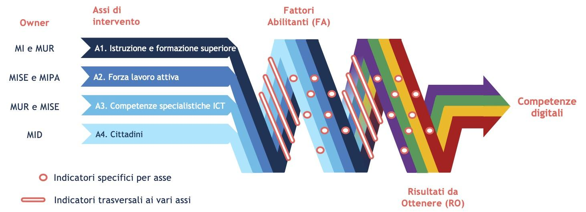

Risultati attesi 
=================

La Strategia si propone di chiudere il *gap* con gli altri Paesi
europei, globalmente e rispetto ai singoli assi di intervento, e di
abbattere i digital divide che caratterizzano il contesto italiano. Al
fine di monitorare i progressi e di valutare l’efficacia della
Strategia, viene predisposto nel Piano Operativo un cruscotto di
indicatori di performance, a partire dagli indicatori inseriti nel
*Digital Economy and Society Index* (DESI) della Commissione Europea e
dai *Digital Maturity Indexes* (DMI) elaborati dall’Osservatorio Agenda
Digitale del Politecnico di Milano. In particolare da questi ultimi
deriva la distinzione tra:

-  *fattori abilitanti*: ovvero gli elementi che permettono la
   partecipazione dei cittadini e dei lavoratori all’economia e alla
   società digitale;

-  *risultati da ottenere*: ovvero gli elementi che misurano l’effettiva
   partecipazione dei cittadini e dei lavoratori all’economia e alla
   società digitale.

In questo modo è possibile tarare adeguatamente le varie azioni previste
dal Piano Operativo, soprattutto quelle che saranno definite nelle
prossime versioni dello stesso, monitorando se e dopo quanto tempo gli
investimenti abilitanti si traducono in risultati concreti. Come
mostrato in Figura 1 sono definiti degli indicatori per ogni asse di
intervento della strategia e degli indicatori trasversali ai vari assi.

|image0|

*Figura 1. Interconnessioni tra gli assi della strategia*

Per tutti gli indicatori vengono definiti nel Piano Operativo dei
risultati obiettivo tali da consentire, progressivamente entro il 2025,
di ridurre il divario con gli altri Paesi UE e di raggiungere, entro
l’annualità stabilita, una tra le prime tre posizioni rispetto ai Paesi
UE più simili a noi per caratteristiche socio-economiche e demografiche
(Germania, Francia, Spagna e Polonia) e al Regno Unito.

